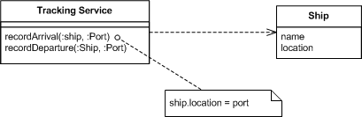
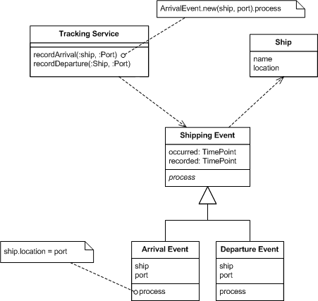
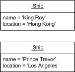
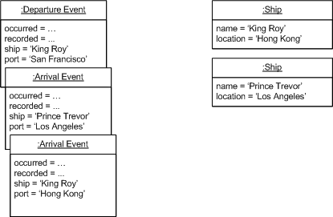

# Event Sourcing

## Intro 

Tay Nguyen
* Software Engineer
* nguyenvanletay@gmail.com

# How does it work
The fundamental idea of Event Sourcing is that of ensuring every change to the state of an application is captured in an event object, and that these event objects are themselves stored in the sequence they were applied for the same lifetime as the application state itself.

# Ship Example

In this example we have many ships on the high seas, and we need to know where they are. A simple way to do this is to have a tracking application with methods to allow us to tell when a ship arrives or leaves at a port.

::: note
In this case when the service is called, it finds the relevant ship and updates its location. The ship objects record the current known state of the ships.
:::

# Ship Example

Introducing Event Sourcing adds a step to this process. Now the service creates an event object to record the change and processes it to update the ship.

# Ship Example 

:::
With Event Sourcing we also capture each event. If we are using a persistent store the events will be persisted just the same as the ship objects are. I find it useful to say that we are persisting two different things an application state and an event log.

The most obvious thing we've gained by using Event Sourcing is that we now have a log of all the changes. Not just can we see where each ship is, we can see where it's been. However this is a small gain. We could also do this by keeping a history of past ports in the ship object, or by writing to a log file whenever a ship moves. Both of these can give us an adequate history.

The key to Event Sourcing is that we guarantee that all changes to the domain objects are initiated by the event objects. This leads to a number of facilities that can be built on top of the event log...
:::

# Facilities

* Complete Rebuild
* Temporal Query
* Event Replay

:::
* Complete Rebuild: We can discard the application state completely and rebuild it by re-running the events from the event log on an empty application.
* Temporal Query: We can determine the application state at any point in time. Notionally we do this by starting with a blank state and rerunning the events up to a particular time or event. We can take this further by considering multiple time-lines (analogous to branching in a version control system).
* Event Replay: If we find a past event was incorrect, we can compute the consequences by reversing it and later events and then replaying the new event and later events. (Or indeed by throwing away the application state and replaying all events with the correct event in sequence.) The same technique can handle events received in the wrong sequence - a common problem with systems that communicate with asynchronous messaging.
:::

# Reversing Events
Reversal is the most straightforward when the event is cast in the form of a difference. An example of this would be "add $10 to Martin's account" as opposed to "set Martin's account to $110".

:::
It's worth remembering that all the capabilities of reversing events can be done instead by reverting to a past snapshot and replaying the event stream. As a result reversal is never absolutely needed for functionality. However it may make a big difference to efficiency since you may often be in a position where reversing a few events is much more efficient than using forward play on a lot of events.
:::

# Problems
Some problem event sourcing architecture have to face

# External Updates

What if event would fire external update events. => That would be problem when replaying events.

:::
It's worth remembering that all the capabilities of reversing events can be done instead by reverting to a past snapshot and replaying the event stream. As a result reversal is never absolutely needed for functionality. However it may make a big difference to efficiency since you may often be in a position where reversing a few events is much more efficient than using forward play on a lot of events.

To handle this you'll need to wrap any external systems with a Gateway. This in itself isn't too onerous since it's a thoroughly good idea in any case. The gateway has to be a bit more sophisticated so it can deal with any replay processing that the Event Sourcing system is doing.

For rebuilds and temporal queries it's usually sufficient for the gateways to be able to be disabled during the replay processing. You want to do this in a way that's invisible to the domain logic. If the domain logic calls PaymentGateway.send it should do so whether or not you are in replay mode. The gateway should handle that distinction by having a reference to the event processor and checking the whether it's in replay mode before passing the external call off to the outside world.
:::

# External Queries
The primary problem with external queries is that the data that they return has an effect on the results on handling an event. If I ask for an exchange rate on December 5th and replay that event on December 20th, I will need the exchange rate on Dec 5 not the later one.

:::
It may be that the external system can give me past data by asking for a value on a date. If it can, and we trust it to be reliable, then we can use that to ensure consistent replay. It also may be that we are using Event Collaboration, in which case all we have to ensure we retain the history of changes.

If we can't use those simple plans then we have to do something a bit more involved. One approach is to design the gateway to the external system so that it remembers the responses to its queries and uses them during replay. To be complete this means that the response to every external query needs to be remembered. If the external data changes slowly it may be reasonable to only remember changes when values change.
:::

# Code Changes

* New features
* Defects fixed
* Temporal logic

:::
New features essentially add new capabilities to the system but don't invalidate things that happened before. These can be added pretty freely at any time. If you want to take advantage of the new features with old events you can just reprocess the events and the new results pop up.

When reprocessing with new features you'll usually want the external gateways turned off, which is the normal case. The exception is when the new features involve these gateways. Even then you may not want to notify for past events, if you do you'll need to put some special handling in for the first reprocess of the old events. It'll be kludgey, but you'll only have to do it once.

Bug fixes occur when you look at past processing and realize it was incorrect. For internal stuff this is really easy to fix, all you need to do is make the fix and reprocess the events. Your application state is now fixed to what it should have been. For many situations this is really rather nice.

Again external gateways bring the complexity. Essentially the gateways need to track the difference between what happened with the bug, and what happens without it. The idea is similar to what needs to happen with Retroactive Events. Indeed if there's a lot of reprocessing to consider it would be worth actually using the Retroactive Event mechanism to replace an event with itself, although to do that you'll need to ensure the event can correctly reverse the buggy event as well as the correct one.

The third case is where the logic itself changes over time, a rule along the lines of "charge $10 before November 18 and $15 afterwords". This kind of stuff needs to actually go into the domain model itself. The domain model should be able to run events at any time with the correct rules for the event processing. You can do this with conditional logic, but this will get messy if you have much temporal logic. The better route is to hook strategy objects into a Temporal Property: something like chargingRules.get(aDate).process(anEvent). Take a look at Agreement Dispatcher for this kind of style.

There is potentially an overlap between dealing with bugs and temporal logic when old events need to be processed using the the buggy code. This may lead into bi-temporal behavior: "reverse this event according to the rules for Aug 1 that we had on Oct 1 and replace it according to the rules for Aug 1 that we have now". Clearly this stuff can get very messy, don't go down this path unless you really need to.

Some of these issues can be handled by putting the code in the data. Using Adaptive Object Models that figure out the processing using configurations of objects is one way to do this. Another might be embed scripts into your data using some directly executable language that doesn't require compilation - embedding JRuby into a Java app for example. Of course the danger here is keeping under proper configuration control. I would be inclined to do it by ensuring any change to the processing scripts was handled in the same way as any other update - through an event. (Although by now I'm certainly drifting away from observation to speculation.)
:::

# When to use Event Sourcing?

You are looking for something that is very scalable?

:::
An example of this would be a system with lots of readers and a few writers. Using Event Sourcing this could be delivered as a cluster of systems with in-memory databases, kept up to date with each other through a stream of events. If updates are needed, they can be routed to a single master system (or a tighter cluster of servers around a single database or message queue) which applies the updates to the system of record and then broadcasts the resulting events to the wider cluster of readers. Even when the system of record is the application state in a database this could be a very appealing structure. If the system of record is the event log, there is are plenty of options for very high performance since the event log is a purely additive structure that requires minimal locking.
:::

# Reference 
https://martinfowler.com/eaaDev/EventSourcing.html

# Thank you