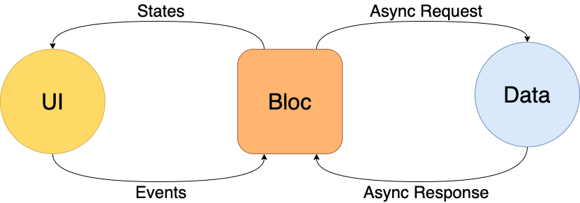

footer: © Dwarves Foundation 2020
slidenumbers: true

# Flutter

<!--  -->

---

## Truong Khanh

- **Android Developer**
- **khanhth@dwarvesv.com**

<!--  -->

---

# Agenda

<!--  -->

- What is flutter?
- Benefit when using flutter?
- Everything is a widget
- BLoC in flutter
- Flutter comparison with jetpack compose

---

# What is flutter?

- Flutter is Google's UI toolkit for building beatiful, natively compiled applications for mobile, web and desktop from a single codebase.


---

# Benefit when using flutter?

- Fast development
  - Hot reload helps developer quickly and easily when building app
- Expressive and Flexible UI
- Native Performance

---

# Everything is a widget

- Inspiration by component in React, everything in flutter is a widget.
- Widget will describe what the view should look like.
- Combine with state, widget will know when and what need to be re-render, make it more effective.

---

# BLoC in flutter

- BLoC standing for Business Logic Components. BLoC is a design pattern, it was the first time introduced by Paolo Soares at DartConf 2018.
- Similar to MVVM pattern.
- Rxdart and Bloc library support.



---

# Flutter comparison with jetpack compose

- Jetpack compose is a suite of library, tools and guidance to help developers create high-quality app.


---

# Flutter comparison with jetpack compose

|Flutter|Jetpack Compose|
|:---|:---|
|Flutter is ready to being use in production apps|Jetpack Compose in the same time is working on by google and far from being usable in production apps|
|Cost more code line to create widget|Cost less code line to create composable because the power of kotlin DSLs|
|Hot Reload is better than "Instant Run" on android studio|@Preview is an amazing feature, it can help you see the design before you need to build the app|

```
Source:
https://medium.com/@jolanda.verhoef/take-aways-comparing-flutter-to-jetpack-compose-a26775617e38
```

---

# **Thank you**


---

# **Q&A**


