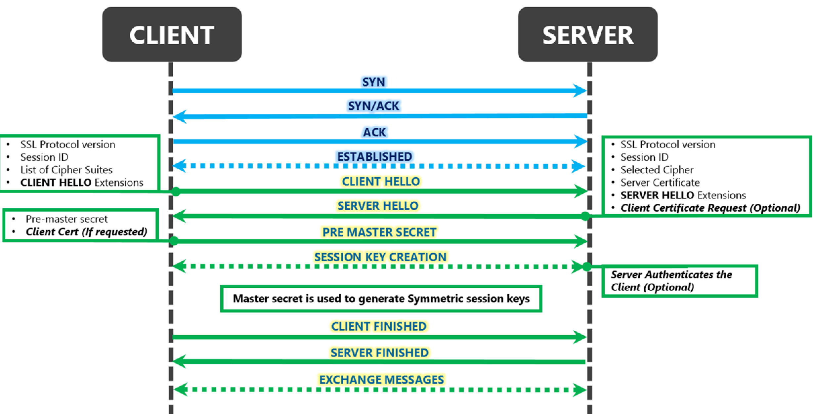
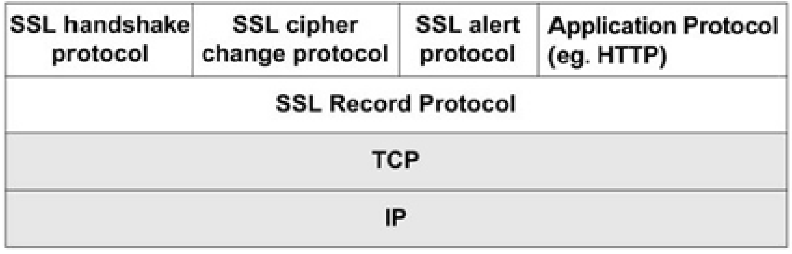
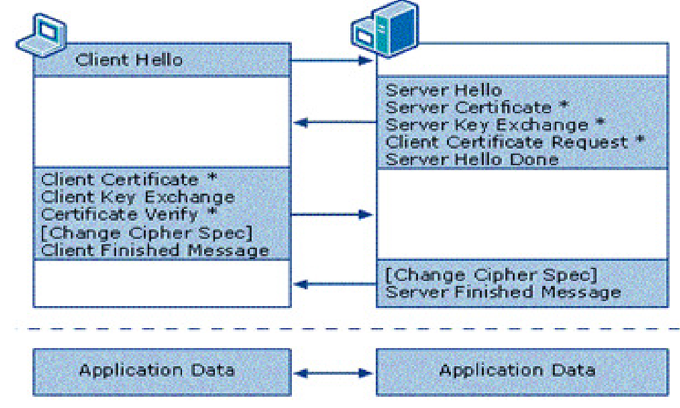
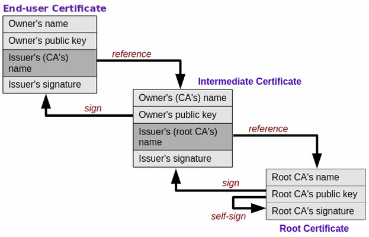
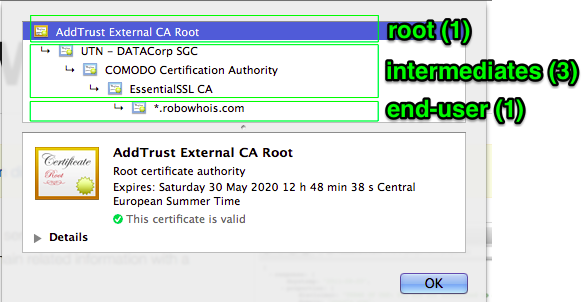

# Security over SSL

- [Security over SSL](#security-over-ssl)
  - [Abstract](#abstract)
  - [Definition](#definition)
  - [How does SSL work](#how-does-ssl-work)
  - [Structure of the SSL protocol](#structure-of-the-ssl-protocol)
      - [Record protocol](#record-protocol)
      - [Handshake protocol](#handshake-protocol)
      - [ChangeCipherSpec protocol](#changecipherspec-protocol)
      - [Alert protocol](#alert-protocol)
  - [Types of SSL certificates](#types-of-ssl-certificates)
    - [DV SSL (Domain Validation)](#dv-ssl-domain-validation)
    - [OV SSL (Organization Validation)](#ov-ssl-organization-validation)
    - [EV SSL (Extended Validation)](#ev-ssl-extended-validation)
    - [Wildcard SSL](#wildcard-ssl)
    - [Multi-Domain SSL](#multi-domain-ssl)
  - [How to get a SSL certificate?](#how-to-get-a-ssl-certificate)
  - [The process of obtaining an SSL certificate](#the-process-of-obtaining-an-ssl-certificate)
  - [Chain of trust](#chain-of-trust)
  - [Threats](#threats)
    - [Phishing attack](#phishing-attack)
      - [Attackers use domain validation to hide their identity](#attackers-use-domain-validation-to-hide-their-identity)
      - [Attackers use Let’s Encrypt for cheap HTTPS setup](#attackers-use-lets-encrypt-for-cheap-https-setup)
      - [Attackers reuse certificates for multiple domains](#attackers-reuse-certificates-for-multiple-domains)
    - [Self-Signed and Wildcard Certificates](#self-signed-and-wildcard-certificates)
    - [Unknown, Untrusted, and Forged Certificate Authorities](#unknown-untrusted-and-forged-certificate-authorities)
    - [Expired SSL/TLS Certificates](#expired-ssltls-certificates)
  - [Vulnerabilities](#vulnerabilities)
    - [CipherSuite rollback attack](#ciphersuite-rollback-attack)
    - [Drop ChangeCipherSpec attack](#drop-changecipherspec-attack)
    - [Version rollback attack](#version-rollback-attack)
    - [Key Exchange Algorithm confusion or Cross-protocol attack](#key-exchange-algorithm-confusion-or-cross-protocol-attack)
    - [Timing attack](#timing-attack)
    - [BEAST (Browser Exploit Against SSL/TLS)](#beast-browser-exploit-against-ssltls)
    - [BREACH (Browser Reconnaissance & Exfiltration via Adaptive Compression of Hypertext)](#breach-browser-reconnaissance--exfiltration-via-adaptive-compression-of-hypertext)
  - [Conclusion](#conclusion)
  - [References](#references)

## Abstract
SSL (Secure Sockets Layer) encryption protects data sent over the internet or a computer network. This prevents attackers (and Internet Service Providers) from viewing or tampering with data exchanged between two nodes—typically a user’s web browser and a web/app server. Most website owners and operators have an obligation to implement SSL/TLS to protect the exchange of sensitive data such as passwords, payment information, and other personal information considered private.

## Definition
SSL is a data transfer security protocol. And in the web hosting industry, the SSL term is often used as a synonym for HTTPS, which is not entirely correct. In fact, the difference between SSL and https is rather significant.

The HTTPS protocol means a secure connection established between the web browser and the server hosting the website. In other words, HTTPS is SSL which runs over HTTP.

So, SSL and https concepts are really interrelated, that’s true, though, https SSL is by no means the only option. SSL is quite versatile and can also work over other application layer protocols besides HTTP.

## How does SSL work
SSL protection is implemented through two main mechanisms: authentication and encryption. Scientifically, SSL Protocol uses asymmetric cryptography to authenticate exchange keys, symmetric encryption to preserve confidentiality, and message authentication codes to ensure message integrity.

```
Symmetric encryption means that one key encrypts and decrypts the message.

Asymmetric encryption requires two different keys, public and private ones. The public key encrypts the messages, and every browser sees it. Private key decrypts them and should be kept secretly on the server.
```

Symmetric encryption is more convenient, but the key must be known to both sides of the process. This is difficult to implement because there are many browsers, while the server where the SSL certificate is installed is only one. The server would have to send the key openly, which is clearly insecure. Therefore, asymmetric encryption is required in order to transmit a symmetric key.

Every time a visitor comes to the site, the browser generates a unique symmetric key, encrypts it with a public key, and sends it to the server. The server compares the private key with the public one and decrypts the message. The entire process takes a few seconds.



## Structure of the SSL protocol
SSL protocol consists of two layers and several protocols. The lower layer located next to the transport lavel in the OSI/ISO reference model consists of SSL Record protocol. The higher layer located immediately above the Record protocol consists of the SSL Handshaking protocols: Handshake protocol, ChangeCipherSpec protocol and Alert protocol.



#### Record protocol 
The Record protocol is responsible for the transfer of blocks of data between the two sides in communication. It takes messages from application level of the OSI/ISO reference models, divides them into manageable blocks, optionally compresses, applies MAC, encrypts and transmits results. It uses security parameters negotiated during handshake phase.

#### Handshake protocol 
The Handshake protocol is the core protocol of SSL/TLS responsible for authentication of each party of the communication and negotiation of security parameters to be used for exchange of encrypted data.

#### ChangeCipherSpec protocol 
The ChangeCipherSpec protocol is used to notify both parties in the communication to upgrade the status of the session to negotiated parameters and move on to secure communication.

#### Alert protocol 
The Alert protocol is used for the notification of errors that occur in communication between the two sides, i.e.: when the connection is closed, when the message can not be decrypted, etc.. During the handshake phase all cryptographic primitives responsible for connection protection are established. Communication between client and server during handshake phase is done with the messages with predefined forms. One example of exchanged messages between client and server 
during the handshake phase:



The list of exchanged messages:

1. ClientHello is type of message where the client notifies the server of the security parameters (protocol version, client random, session ID, cipher suite, compression method) which he supports and wants to use.
2. ServerHello is a message where the server notifies the client of the security parameters that will be used (protocol version, server random, cipher suite, session ID, compression method).
3. Certificate is a message which transmitted certificate for server and optional message for transmitted client’s certificate.
4. ServerKeyExchange message is following ServerHello message if using anonymous negotiation or server Certificate message if there are not enough informations for the client in order to exchange premaster secret to the server. Optional message.
5. CertificateRequest message is a message where the server requires certificate from the client. Optional message.
6. ServerHelloDone message is a message where the server notifies that all requests are sent to the client in order to establish a communication.
7. ClientKeyExchange message contains generated premaster key encrypted with server’s public key. Based on the premaster secret, later will be generated a master secret and based on the master secret will be generated all other keys in order to encrypt the traffic.
8. CertificateVerify message is a message where the client confirms that he has a private key corresponding to the public key from the certificate. This message is sent only if the client previously sent a client Certificate message. Optional message.
9.  ChangeCipherSpec message is a type of message where the other party in communication is informed about the start of the use of agreed security settings. After these messages all the other messages that are exchanged are encrypted.
10. Finished message informs that all the steps of negotiations are done and that a secure communication is established.

## Types of SSL certificates
Certificates vary in degree of validation and in the number of domains. The SSL security features provided to users change accordingly either.

**A degree of validation**
* DV SSL - Domain Validation - a certificate with domain validation;
* OV SSL - Organization Validation - a certificate with verification of the organization (company);
* EV SSL - Extended Validation - a certificate with extended validation.

**A number of domains**
* Wildcard SSL - a certificate aimed at the domain and its subdomains;
* Multi-Domain SSL (MDC SSL or SAN SSL (Subject Alternative Name)) - a certificate focused on multiple domains.

### DV SSL (Domain Validation)
Such certificates are aimed at non-commercial sites since they only confirm the web server dealing with the resource. The DV certificate doesn't contain any identifying information in the organization name field. Usually, you can see "Persona Not Validated" or "Unknown" there.

The DV type is a relatively cheap SSL certificate available to individuals. To obtain it, you need to prove only the right to use a chosen domain name. The procedure is rather simple: the domain owner receives an email with a request to click the link to confirm the usage right.

The process of obtaining a DV SSL certificate takes only a few minutes. In the details of each certificate, you can see if it is a DV or OV type. In DV certificates, only the domain name is present.

### OV SSL (Organization Validation)
OV SSL certificate is more reliable than DV since it additionally confirms the registration data of the company owning the online resource.

The certificate is intended for legal entities, and therefore the required by SSL information includes more details. To get OV SSL, you must prove the right to use a domain name and confirm company data. In addition, you should be ready to answer the control call of the certification authority to the phone number specified in the order form of an SSL certificate or available in public access (as a contact phone number of the company). It is also necessary to translate the registration documents into English and notarize them.

The process of obtaining a certificate takes about 3-10 days. In OV certificates, there is information about the legal address and company name.

### EV SSL (Extended Validation)
EV SSL first appeared in 2007. It is primarily aimed at websites conducting financial transactions and therefore needing the highest level of confidentiality. And EV SSL encryption technology is a great option because it provides web resources with maximum data protection.

These are so-called green line certificates available only to legal entities. And a company which is ready to create SSL certificate of such a type must be prepared to undergo a huge number of all sorts of checks. The OV SSL requirements hold valid, but now they are supplemented with the check of a certificate of state registration and confirmation of being in the Unified State Register of Legal Entities.

EV certificates are useful if you need to tie up a domain with a physical organization. Here is an example of the Bank of America company and its domain bankofamerica.com. In this case, the certificate with the verification ensures that the resource in question really belongs to the actual bank (namely, Bank of America).

The duration of the process of obtaining a DV SSL certificate is about 2 weeks. A distinctive feature of EV certificates is a green line containing the company name displayed in the browser, which should indicate the maximum website SSL protection. So we can safely summarize that the EV type ensures the most secure SSL certificates.

### Wildcard SSL
Wildcard SSL is a certificate which applies to the domain and the entire subset of its subdomains. Say, if the 'domain.ua' domain is used, the wildcard certificate will include the 'domain.com' domain itself, as well as any subdomains of the lower levels: mail.domain.ua, 1ev.domain.ua, r.info.dnipro.domain.ua, etc. Typically, such SSL certificates are visually designated as *.domain.ua and cost about 4 times more than DV does.

### Multi-Domain SSL
Multi-Domain SSL is another example of SSL products: a certificate for several different domains. So a multi-domain SSL certificate can cover domain.ua, market.com, river.it domains, but it doesn't apply to subdomains.

## How to get a SSL certificate?
To purchase an SSL certificate, you should contact a special company called Certificate Authority (CA). The process can be implemented in 2 ways:
* In automatic mode, through various scripts.

* In manual mode, say, when receiving an EV certificate or filling out a form on the website of the SSL provider.

CA is a kind of administrative regulatory authority which issues SSL certificates to domain name holders. In addition, it is these organizations which conduct the appropriate checks when needed.

## The process of obtaining an SSL certificate
The process of getting DV SSL certificates (no matter, free or paid ones) consists of the following steps:

1. The request formation. On the reseller's website of SSL certificates or a domain registrar resource (or in a terminal console), the user fills out a small form with basic information: domain, company and department names, email, etc. The result is the encrypted file which contains all the data entered previously. It is called a CSR request (Certificate Signing Request).
2. Data confirmation. The CSR file is being sent to the CA. CA, in turn, checks in the DNS system the existence of an A record for the domain specified in the CSR. Also, CA asks the holder to confirm the right to use the domain in one of several possible ways. Among others, CA may require you to add a TXT record to your domain’s DNS system or a specific content file - to the hosting. Thus, CA will see that it is the domain holder who is trying to obtain a certificate, not somebody else.
3. Getting a certificate. If everything went well, it's time to generate an SSL certificate. That is, CA sends the certificate files to the email user (and we’re talking about a couple of documents, not a single file). In the classic case, the sent set contains the following files:
   * File with the .crt extension: public part, a signed certificate;
   * File with .key extension - private part, a certificate key (private key);
   * Sometimes chain.crt files are also sent: intermediate certificate or certificate chain. But in most cases, the chain can be found in open sources.

## Chain of trust
When a client's browser checks for a certificate on a site, it analyzes a few files called a chain of trust. The term refers to a sequence of several documents which certify each other: End-user Cert -> Intermediate Cert -> Root Cert.



* Root Cert is a certificate issued by a trusted CA. Root certificates are pre-installed in all web browsers and operating systems and considered to be unconditionally trusted, their reliability is beyond doubt.
* Intermediate Cert is, as the name implies, an intermediate certificate signed by Root CA.
* End-user Cert is, as you might have already guessed, an end-user certificate signed by a CA. This is the very SSL certificate to which our article is devoted.



There are also services to check the SSL certificates:
* SSLShopper offers a quick and simple way to check a chain of trust as well as the correctness of your certificate customization;
* SSL Labs provides a detailed report on certificate and web server settings.

## Threats

### Phishing attack
Attackers are also exploiting the public notion that sites using HTTPS are secure by adopting SSL for their malicious sites.

#### Attackers use domain validation to hide their identity
One of the most important pieces of certificate information is the validation type. There are three different types of validation, which are based on how strongly the publisher was evaluated before the certificate was issued:

* Domain-Control Validation (only the control of the subject domain was verified)
* Organization Validation (the identity of the company behind the domains was checked against registers, etc.)
* Extended Validation (requires the strongest, most rigorous checks of the company identity).

#### Attackers use Let’s Encrypt for cheap HTTPS setup
Services such as Let’s Encrypt are enabling website owners to set up HTTPS easily and cheaply, thus contributing to a safer and better Internet. However, attackers can also utilize these services to make their sites look more trustworthy. Based on an analysis of our traffic, Let’s Encrypt certificates are used on a much higher proportion of malicious sites using HTTPS than they are across randomly sampled HTTPS sites from our traffic (61.1% vs 13.5%).

#### Attackers reuse certificates for multiple domains
Another example of useful information that can be extracted from the certificates are Subject Alternative Names (SANs). This field lists all domains where the certificate is valid. In this way, it can be possible to link numerous malicious domains that share a certificate together.
Below is an example screenshot of SANs listed in a certificate belonging to vend[.]world sites – a known group of phishing sites.

### Self-Signed and Wildcard Certificates
Server administrators frequently create self-signed “wildcard” certificates on-demand using free, OpenSSL. While quick and easy, this practice significantly erodes trust because no trusted third-party CA ever verifies these certificates.

Using a wildcard certificate on a publically facing webserver increases the risk that cybercriminals will use the server to host malicious websites in phishing campaigns. To eliminate this problem, organizations should avoid using wildcard certificates on production systems, especially public-facing ones. Instead, use subdomain-specific certificates that are rotated often.

### Unknown, Untrusted, and Forged Certificate Authorities
Maintaining the trust required for today’s global business demands a known and reputable CA that both parties can rely upon to authenticate the conversation. Over time, an enterprise might discover that it has been using certificates from dozens of unknown and untrusted CAs. For example, China’s Certificate Authority—CCNIC—was recently cited as an untrusted CA.

In 2014, an Internet security organization named Netcraft, found dozens of fake digital certificates impersonating banks, ecommerce sites, ISPs and social networks deployed across the Internet. Even well-known CAs like GoDaddy can be compromised. Fake certificates purporting to be for GoDaddy’s email service could allow an attacker to masquerade as GoDaddy if applications don’t verify a certificate’s trustworthiness.

To remediate the problem, organizations must identify and remove all certificates associated with unknown and untrusted CAs, and replace them with new certificates from trusted sources.

### Expired SSL/TLS Certificates
Expired certificates either cause unplanned system outages or open a door through which hackers can enter your network, or both. In 2013, Microsoft Azure experienced a worldwide outage due to an expired certificate. As a result, this leading cloud provider was down for hours and issued service credits. In 2014, tens of thousands of payment terminals used to process credit card payments in the U.S. stopped working because of an expired certificate.

An SSL/TLS session that uses an expired certificate should not be trusted. Accepting an expired certificate makes users vulnerable to man-in-the-middle (MITM) attacks. To remediate this issue, all expired certificates should be identified and removed from servers.

## Vulnerabilities

### CipherSuite rollback attack 
Cipher suite is a list of cryptographic algorithms that are proposed during the handshake phase between the client and server. List of proposed algorithms is traveling in clean text format as part of the initial ClientHello messages. It allows MITM attacker to intercept the message and replacing client’s cipher suite with his cipher suite that supports weaker versions of algorithms or NULL-Cipher list, so communication continues to take place with weaker algorithms or algorithms for protection are not used at all. The consequences of such an attack could be disastrous for the client: the attacker could imitate a valid user, could access the server, obtain user credentials and the like.

In version SSL3.0 this failure is resolved with the authentication of all handshake messages in the final Finished message, which contains MAC on handshake protocol messages, so the attack on cipher suite might be noticed at the end of the handshake phase and reject such a session.

### Drop ChangeCipherSpec attack 
Drop ChangeCipherSpec attack is weakness of SSL2.0. The ChangeCipherSpec message is used to notify both parties in the communication to upgrade the status of the session to negotiated parameters in the handshake phase. When the initial handshake phase is completed, the client and server exchange ChangeCipherSpec message to signal the other side that in the future all communication will be done only with the agreed parameters. However, before one side send the ChangeCipherSpec message MITM attacker can send Finished message to other side, which furthermore would cause the start of communication without any changes and adoptions of agreed security parameters, or it could simply delete ChangeCipherSpec message, so the client and the server would never establish a communication. 

The solution for this problem is to force both parties to ensure that a ChangeCipherSpec message is received before accepting the Finished message.

### Version rollback attack
Version rollback attack is a vulnerability of SSL 3.0. It is a type of attack where the attacker can lead the client and server side of the communication to use a lower version of the protocol SSL2.0 instead of one they should use and support SSL3.0. The attacker modifies ClientHello message SSL3.0, so it looks like ClientHello message SSL2.0. In that way it can use the weaknesses of protocol SSL2.0, like weaker cipher suite of proposed algorithms.

SSL 3.0 and later TLS versions offer protection for version rollback attacks with the Finished message.

### Key Exchange Algorithm confusion or Cross-protocol attack
Key Exchange Algorithm confusion or Cross-protocol attack is vulnerability of SSL3.0. Server can send to the client the temporary key parameters signed under its long-term certified signing key in ServerKeyExchange messages. The problem is that the signature of the temporary key parameters does not include part of the field where it is specified which type of key is used, and thus created a basis for a confusion type of attack. The attacker forced the server to use the Diffie-Hellman key exchange and client to use RSA key 
xchange. This leads to confusion where the client may interpret the Diffie-Hellman parameters (p, g) as an exponent and module of RSA key. In the following example we can see how the attack works. 
```
[ClientHello]
    Client ->Attacker: SSL_RSA… 
    Attacker->Server: SSL_DHE_RSA… 
[ServerHello] 
    Server->Attacker: SSL_DHE_RSA… 
    Attacker->Client: SSL_RSA… 
[ServerKeyExchange] 
    Server->Attacker: {p,g,y}Ks
    Attacker->Client: {p,g,y}Ks
[ClientKeyExchange]
    Client->Attacker: k^g mod p 
    Attacker->Server: g^x mod p
 ```
 k^g mod p, k is premaster secret. For successful attack the client intercept premaster key which will be encrypted with RSA key, or Diffie Hellman parameters (g, p) which attacker already knows. Furthermore, the attacker sends to server g^x mod p whereby the server interprets premaster key as g^xy mod p. Attacker in future can intercept, read and change all the exchanged messages between the client and the server, act as a server to the client and as a client to the server. 

Proposed solution for cross protocol attack was a new protocol extension indicating the new format of ServerKeyExchange message which includes explicit indicators of the entity (server), the type of key exchange algorithm, the handshake messages exchanged and the parameters of the key exchange.

### Timing attack
Timing attack is a form of side channel attack that exploits time to reveal the encrypted data. Attack exploits timing variants of cryptographic operations for different values of the input data. This attack computes the private key on the server by calculating the time difference between sending a specially made ClientKeyExcange messages and receiving Alert message that alerts the irregular premaster secret.

The most widely used method for defense from this attack is RSA blinding. Because the timing attacks expose information by measuring the amount of time required to perform mathematical operations, The system use a random-generated number r in calculations. Since a different r is used for each message, blinding prevents an attacker from computation time variant operations during decoding.

### BEAST (Browser Exploit Against SSL/TLS)
In a BEAST attack, the attacker acts as a MITM and uses specially-crafted plaintext input to decrypt the contents of an SSL-encrypted session between a Web browser and an website. This type of attack allows the attacker to recover sensitive information (e.g. HTTP Authentication cookies).

In TLS 1.1 and 1.2, the vulnerability is resolved. It the browser does not support these versions, disable all block-based cipher suites in server’s SSL configuration is an alternative workaround.

### BREACH (Browser Reconnaissance & Exfiltration via Adaptive Compression of Hypertext)
The BREACH attack manipulates the use of HTTP-level compression to pull out information from HTTPS-protected data, including email addresses, security tokens, and other plain text strings.

It is advised to remove compression support on dynamic content and use rate-limiting requests to avoid compression manipulation.

## Conclusion
SSL is vital to Web security. It provides a strong sense of confidentiality, message integrity, and server authentication to users. The online businesses is tied closely to consumer confidence in the operation of SSL across the net. This way, businesses will be able to continue to grow in popularity as users grow more confidant in shopping and banking online, and embracing new online applications. However, SSL is not the silver bullet to counter cybercrimes. Other security measures and validation must be considered, even when SSL is implemented.

## References
https://www.ssl.com/faqs/faq-what-is-ssl/  
https://www.venafi.com/education-center/ssl/common-ssl-attacks  
Ćurguz, Jelena. (2016). Vulnerabilities of the SSL/TLS Protocol. Computer Science & Information Technology. 6. 245-256. 10.5121/csit.2016.60620. 