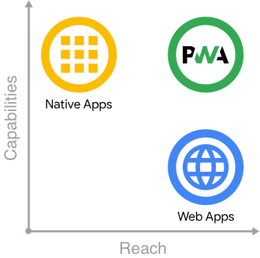

# Progressive Web Apps

| Status        | Trial                                                |
| :------------ | :--------------------------------------------------- |
| **Author(s)** | Khac Vy (vytk@dwarvesv.com) |
| **Type**      | Technique                                            |

## Objective

An introduction about Progressive Web App (PWA). The main goal is giving some understandings about PWA and how to deliver a web experience your users will love. 

## Motivation

Native applications, are known for being incredibly rich and reliable. They're ever-present, on home screens, docks, and taskbars. They work regardless of network connection. They launch in their own standalone experience. They can read and write files from the local file system, access hardware connected via USB, serial or bluetooth, and even interact with data stored on your device, like contacts and calendar events. In native applications, you can do things like take pictures, see playing songs listed on the home screen, or control song playback while in another app. Native applications feel like part of the device they run on.

If you think about native apps and web apps in terms of capabilities and reach, native apps represent the best of capabilities whereas web apps represent the best of reach. So where do Progressive Web Apps fit in?

Progressive Web Apps (PWA) are built and enhanced with modern APIs to deliver native-like capabilities, reliability, and installability while reaching anyone, anywhere, on any device with a single codebase.

## Benefit

Progressive Web Apps provide you with a unique opportunity to deliver a web experience your users will love. Using the latest web features to bring native-like capabilities and reliability, Progressive Web Apps allow what you build to be installed by anyone, anywhere, on any device with a single codebase.

## Code & Documents/Slides

- [Slide](Documents/slide.md)
- [Code](Code)

## Tutorials and Examples

- [Demo](Code)
