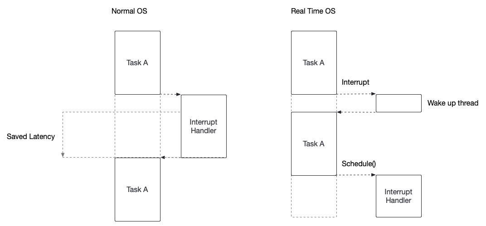
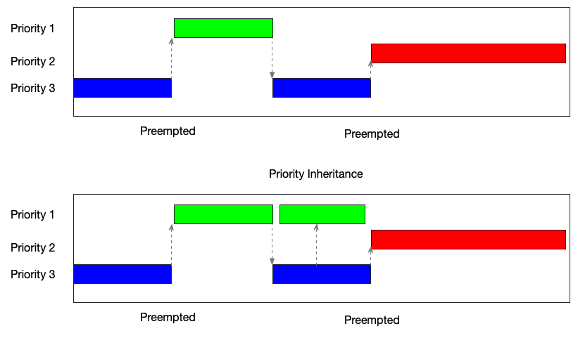

# Real-Time OS design

## Definition:
- Real-Time System: is Deterministic System:
  - Repeatable results
  - Expected results
  - No unbounded latency
  - Deterministic worst-case scenarios

- Latency:
  - The time between when an event is expected to happen, to the time it happens
  - Causes of latency in OS:
    - Interrupts being disabled
    - Current interrupt executing
    - Shared resources and locking

- Interrupts: Is the way that devices send a signal to CPU to perform a task for them

## Interrupt time frame in Real-Time OS design and normal OS:

### Threaded Interrupts:
- CPU receives several interrupts from IO devices throughout one or more interrupt lines (bus. The normal OS handles the whole interrupt, Real-Time Design OS receives the interrupt and schedule the interrupt to run later.

- User tasks can run a higher priority than interrupts. Set required interrupts higher that your task

### Priority inversion:
When something runs when something else should be

- This is the example of using Priority inheritance to fix the error when a task with priority three never run because the priority 2 task is higher, priority 3 task became preempted forever.
- Instead, the priority 3 task after priority 1 task complete, it's inherited the priority 1 and run before priority 2

## Types:

1. Hard Real-Time:
   1. Definition: Mathematically prove that every process time frame must be bounded latency

   2. Examples:
      1. Airplane engine controls
      2. Nuclear power plants
      3. Mars Lander
      4. Space Shuttle

2. Soft Real-Time:
   1. Definitions: the ratio of unbounded latency process time frame / all processing time frame is tiny

   2. Examples:
      1. Video systems
      2. Video games
      3. Vanilla Linux