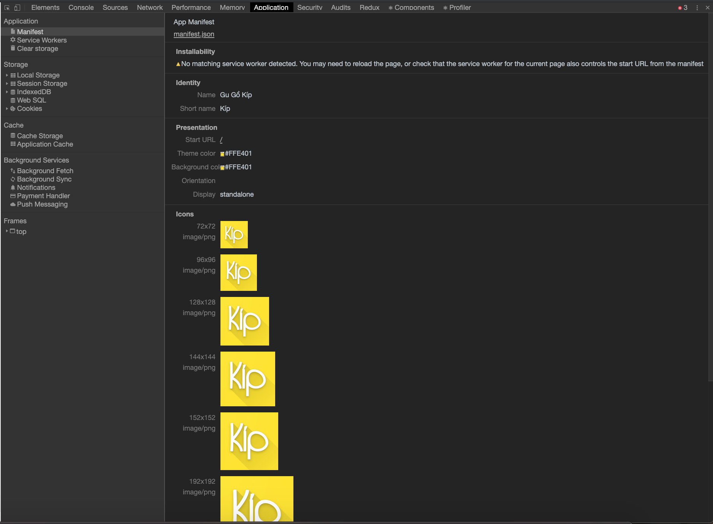

# Agenda

1. What is Progressive Web Apss (PWA) ?
2. Core concepts
3. Demo

---

## What is PWA ?

A **progressive web application (PWA)** is a type of application software delivered through the web, built using common web technologies including HTML, CSS and JavaScript. It is intended to work on any platform that uses a standards-compliant browser. Functionality includes working offline, push notifications, and device hardware access, enabling creating user experiences similar to native applications on desktop and mobile devices.

---

## PWA

PWA are user experiences that have the reach of the web, and are:

- **Reliable** - Load instantly and never show the downasaur, even in uncertain network conditions.
- **Fast** - Respond quickly to user interactions with silky smooth animations and no janky scrolling.
- **Engaging** - Feel like a natural app on the device, with an immersive user experience.

---

## Core concepts

- Service worker
- The Web App Manifest

---

## What is service worker ?

A service worker is a script that your browser runs in the background, separate from a web page, opening the door to features that don't need a web page or user interaction. Today, they already include features like **push notifications** and **background sync**. In the future, service workers might support other things like periodic sync or geofencing.

---

## The service worker life cycle


---

## The service worker events


---

## Registration

```javascript
if ("serviceWorker" in navigator) {
  navigator.serviceWorker
    .register("/my-service-worker.js")
    .then(function(registration) {
      console.log("Service worker registered!");
    })
    .catch(function(err) {
      console.log("Registration failed!");
    });
}
```

---

## Installation

```javascript
self.addEventListener("install", event => {
  event.waitUntil(
    caches.open("app-cache-v1").then(cache => {
      return cache.addAll([
        "./sw-test/",
        "./sw-test/index.html",
        "./sw-test/style.css",
        "./sw-test/app.js",
        "./sw-test/image-list.js",
        "./sw-test/star-wars-logo.jpg",
        "./sw-test/gallery/",
        "./sw-test/gallery/bountyHunters.jpg"
      ]);
    })
  );
});
```

---

## Activation

```javascript
self.addEventListener("activate", event => {
  var cacheKeeplist = ["app-cache-v2"];

  event.waitUntil(
    caches.keys().then(keyList => {
      return Promise.all(
        keyList.map(key => {
          if (cacheKeeplist.indexOf(key) === -1) {
            return caches.delete(key);
          }
        })
      );
    })
  );
});
```

---

## The Web App Manifest

The web app manifest is a simple JSON file that tells the browser about your web application and how it should behave when 'installed' on the user's mobile device or desktop.

---

## The Web App Manifest

```javascript
{
  "short_name": "Kíp",
  "name": "Gu Gồ Kíp",
  "icons": [
    {
      "src": "/images/icons-192.png",
      "type": "image/png",
      "sizes": "192x192"
    },
    {
      "src": "/images/icons-512.png",
      "type": "image/png",
      "sizes": "512x512"
    }
  ],
  "start_url": "/",
  "background_color": "#3367D6",
  "display": "standalone",
  "scope": "/",
  "theme_color": "#3367D6"
}
```

---

## Key manifest properties

- **short_name** and/or **name** - used on the user's home screen, launcher, or other places where space may be limited. **name** is used when the app is installed.

- **icons** - When a user installs the PWA, you can define a set of icons for the browser to use on the home screen, app launcher, task switcher, splash screen, and so on.

- **start_url** - is required and tells the browser where your application should start when it is launched, and prevents the app from starting on whatever page the user was on when they added your app to their home screen.

- **background_color** - is used on the splash screen when the application is first launched on mobile.

- **display** - is a string that determines the developers’ preferred display mode for the website.

  | Property       | Use                                                                                                                                                                                  |
  | :------------- | :----------------------------------------------------------------------------------------------------------------------------------------------------------------------------------- |
  | **fullscreen** | Opens the web application without any browser UI and takes up the entirety of the available display area.                                                                            |
  | **standalone** | Opens the web app to look and feel like a standalone native app. The app runs in its own window, separate from the browser, and hides standard browser UI elements like the URL bar. |
  | **minimal-ui** | This mode is similar to fullscreen, but provides the user a minimal set of UI elements for controlling navigation (such as back, forward, and reload).                               |
  | **browser**    | A standard browser experience.                                                                                                                                                       |

- **scope** - defines the set of URLs that the browser considers to be within your app, and is used to decide when the user has left the app.

- **theme_color** - sets the color of the tool bar, and may be reflected in the app's preview in task switchers.

---

## Add the web app manifest to your pages

```html
<link rel="manifest" href="/manifest.json" />
```

---

## Test your manifest

To verify your manifest is setup correctly, use the Manifest pane in the Application panel of Chrome DevTools.



---

## References

- [https://web.dev/progressive-web-apps](https://web.dev/progressive-web-apps)
- [https://developers.google.com/web/fundamentals/primers/service-workers](https://developers.google.com/web/fundamentals/primers/service-workers)
- [https://developer.mozilla.org/en-US/docs/Web/API/Service_Worker_API/Using_Service_Workers](https://developer.mozilla.org/en-US/docs/Web/API/Service_Worker_API/Using_Service_Workers)

---

## Demo

> Demo
