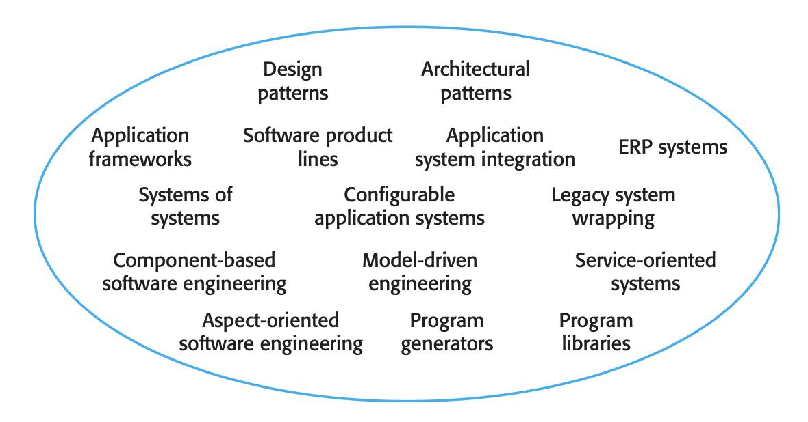

# Software Reuse

| Status        | Assess                                                |
| :------------ | :-----------------------------------------------------|
| **Author(s)** | Bien Vo (bienvh@dwarvesv.com)                         |
| **Type**      | Techniques                                            |

## Objective
This document describes what is **Software reuse** and few ways to approach to system development based on large-scale **Software reuse**.

<figure class="image">
  
  <figcaption style="text-align: center">The reuse landscape</figcaption>
</figure>

## Motivation
Reusable software of different kinds is now widely available, as a software engineering strategy called **Software reuse**. But not anyone also has correctly awareness about it.
Have you ever wondered why we use framework when developing software or why web service standards are being used widely? This document is a brief explanation for these questions.

On the other hand, this document is an answer for few matters in software engineering and business such as lower software production and maintenance costs, faster delivery of systems, and increased software quality to get the final goal is the increment of return on software investments.

## Benefits
 This is regarded as an overview of **Software reuse**, after reading, you will:
 - Get a generalized look about **Software reuse**, it is not only concept, benefits but also the problems when applying this strategy.
 - Know a few approaches of **Software reuse** such as **Framework**, **Product line** and their role in software development.
