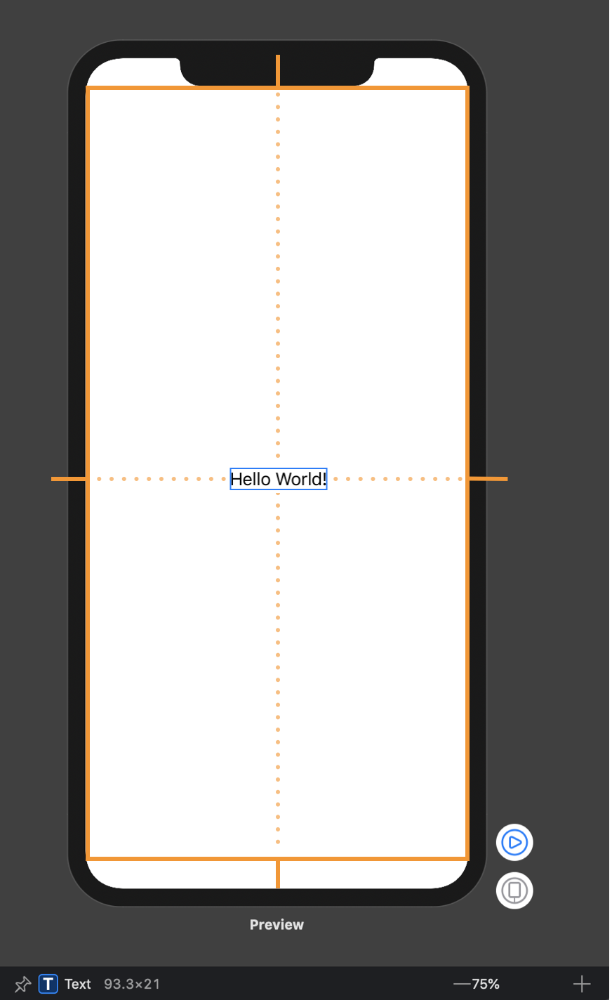
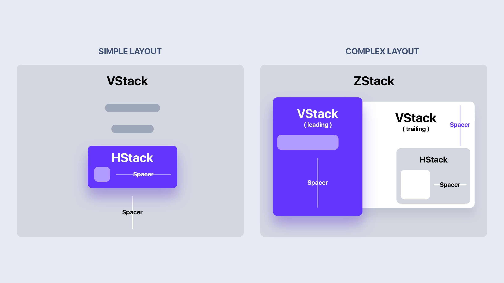

# Introduction

SwiftUI is the new UI framework, which Apple introduced in WWDC 2019.
Some main features:
- Declarative syntax (using state to keep UI up to date with data, like React :-?)
- Cross Apple platforms

There are 2 companions with SwiftUI:
- Combine -> a reactive programing framework (similar to old RxSwift)
- Xcode canvas -> Help Live Preview (hot reload in Flutter) come true in XCode. User dont need to choose between code UI visually or programmatically, all making UI things are synchronous between two

SwiftUI works for iPad, Mac, Apple TV and Watch. There are minimal code changes and you can reuse a lot of the same components. The Stacks, Controls and Layout system will work the same, with a few adjustments. The philosophy for SwiftUI is not to write once, apply everywhere, but to learn one, apply anywhere.

 Most controls and data work across all platforms, with some minor layout changes and navigation. Those controls will be automatically translated for you, using the appropriate UI for their specific platform. For example, a Picker will look like a List in iOS, but it'll look like a drop-down for Mac.

# Learn once, apply anywhere

When Apple announced SwiftUI, they made an important distinction: SwiftUI is not a multi-platform framework, but is instead a framework for creating apps on multiple platforms.

That might seem like the same thing being said in two different ways, but in practice it means that many parts of SwiftUI work great on iOS, but aren’t available on macOS, or are designed specifically for watchOS and so aren’t available anywhere else.

Yes, the core of your app remains unchanged: your models, your networking, and much of your user interface. But to get great apps – to build apps that are really tailored for each of Apple’s platforms – you need to add some platform-specific enhancements. How should your app use the Digital Crown on watchOS? What about the Play/Pause button on tvOS? Or right-click menus on macOS?

# Layout system

## Layout Process



1. Parent Proposes Size for Child
First, the root view offers the text a proposed size – in this case, the entire safe area of the screen, represeted by an orange rectangle.

2. Child Chooses its Size
Text only requires that much size to draw its content. The parent has to respect the child's choice. It doesn't stretch or compress the child.

3. Parent Places Child in Parent’s Coordinate Space
And now the root view has to put the child somewhere, so it puts in right in the middle.

--- 

## Frame
First, forget everything you know about frames in UIKit or AppKit. Those have nothing to do with frame(width:height:alignment:) and other related methods in SwiftUI.

Let’s take a 60x60 image and display it using SwiftUI’s Image. Look what happens if I set the frame to 80x80.


## Stacks



When creating a SwiftUI view, you describe its content in the view’s body property. However, the body property only returns a single view. You can combine3 and embed multiple views in stacks4.

HStack group views together horizontally
VStack – vertically
ZStack – back to front

---

### Stack Layout Process
There are three simple steps in the stack layout process.
1. The stack figures out the internal spacing and subtracts it from the size proposed by its parent view.
2. The stack divides the remaining space into equal parts for each of the remaining views. It then proposes one of those as the size for the least flexible child. Whatever size it claimed, it deducts that from the unallocated space. And then it repeats.
3. All children have sizes. The stack lines them up with the spacing and aligns them according to the specified alignment. By default, the alignment is – you guessed it – .center. Finally, the stack chooses its own size so that it exactly encloses the children.

# Migrating from UIKit to SwiftUI
- UITableView: List
- UICollectionView: No SwiftUI equivalent
- UILabel: Text
- UITextField: TextField
- UITextField with isSecureTextEntry set to true: SecureField
- UITextView: No SwiftUI equivalent
- UISwitch: Toggle
- UISlider: Slider
- UIButton: Button
- UINavigationController: NavigationView
- UIAlertController with style .alert: Alert
- UIAlertController with style .actionSheet: ActionSheet
- UIStackView with horizontal axis: HStack
- UIStackView with vertical axis: VStack
- UIImageView: Image
- UISegmentedControl: SegmentedControl
- UIStepper: Stepper
- UIDatePicker: DatePicker
- NSAttributedString: Incompatible with SwiftUI; use Text instead.

# Property Wrappers in SwiftUI

Property Wrappers feature described in [SE-0258](https://github.com/DougGregor/swift-evolution/blob/property-wrappers/proposals/0258-property-wrappers.md) proposal. The main goal here is wrapping properties with logic which can be extracted into the separated struct to reuse it across the codebase.

## @State

@State is a Property Wrapper which we can use to describe View’s state. SwiftUI will store it in special internal memory outside of View struct. Only the related View can access it. As soon as the value of @State property changes SwiftUI rebuilds View to respect state changes. Here is a simple example.

```Swift
struct ProductsView: View {
    let products: [Product]

    @State private var showFavorited: Bool = false

    var body: some View {
        List {
            Button(
                action: { self.showFavorited.toggle() },
                label: { Text("Change filter") }
            )

            ForEach(products) { product in
                if !self.showFavorited || product.isFavorited {
                    Text(product.title)
                }
            }
        }
    }
}
```

## @Binding

@Binding provides reference like access for a value type. Sometimes we need to make the state of our View accessible for its children. But we can’t simply pass that value because it is a value type and Swift will pass the copy of that value. And this is where we can use @Binding Property Wrapper.

```Swift
struct FilterView: View {
    @Binding var showFavorited: Bool

    var body: some View {
        Toggle(isOn: $showFavorited) {
            Text("Change filter")
        }
    }
}

struct ProductsView: View {
    let products: [Product]

    @State private var showFavorited: Bool = false

    var body: some View {
        List {
            FilterView(showFavorited: $showFavorited)

            ForEach(products) { product in
                if !self.showFavorited || product.isFavorited {
                    Text(product.title)
                }
            }
        }
    }
}
```

## @ObservedObject

@ObservedObject work very similarly to @State Property Wrapper, but the main difference is that we can share it between multiple independent Views which can subscribe and observe changes on that object, and as soon as changes appear SwiftUI rebuilds all Views bound to this object. Let’s take a look at an example.

```Swift
import Combine

final class PodcastPlayer: ObservableObject {
    @Published private(set) var isPlaying: Bool = false

    func play() {
        isPlaying = true
    }

    func pause() {
        isPlaying = false
    }
}
```
```Swift
struct EpisodesView: View {
    @ObservedObject var player: PodcastPlayer
    let episodes: [Episode]

    var body: some View {
        List {
            Button(
                action: {
                    if self.player.isPlaying {
                        self.player.pause()
                    } else {
                        self.player.play()
                    }
            }, label: {
                    Text(player.isPlaying ? "Pause": "Play")
                }
            )
            ForEach(episodes) { episode in
                Text(episode.title)
            }
        }
    }
}
```

Remember, we can share ObservableObject between multiple views, that’s why it must be a reference type/class.

## @EnvironmentObject

Instead of passing ObservableObject via init method of our View we can implicitly inject it into Environment of our View hierarchy. By doing this, we create the opportunity for all child Views of current Environment access this ObservableObject.

```Swift
class SceneDelegate: UIResponder, UIWindowSceneDelegate {

    var window: UIWindow?

    func scene(_ scene: UIScene, willConnectTo session: UISceneSession, options connectionOptions: UIScene.ConnectionOptions) {
        let window = UIWindow(frame: UIScreen.main.bounds)
        let episodes = [
            Episode(id: 1, title: "First episode"),
            Episode(id: 2, title: "Second episode")
        ]

        let player = PodcastPlayer()
        window.rootViewController = UIHostingController(
            rootView: EpisodesView(episodes: episodes)
                .environmentObject(player)
        )
        self.window = window
        window.makeKeyAndVisible()
    }
}

struct EpisodesView: View {
    @EnvironmentObject var player: PodcastPlayer
    let episodes: [Episode]

    var body: some View {
        List {
            Button(
                action: {
                    if self.player.isPlaying {
                        self.player.pause()
                    } else {
                        self.player.play()
                    }
            }, label: {
                    Text(player.isPlaying ? "Pause": "Play")
                }
            )
            ForEach(episodes) { episode in
                Text(episode.title)
            }
        }
    }
}
```

## @Environment

SwiftUI already has an Environment populated with system-wide settings. We can easily access them with @Environment Property Wrapper.

```Swift
struct CalendarView: View {
    @Environment(\.calendar) var calendar: Calendar
    @Environment(\.locale) var locale: Locale
    @Environment(\.colorScheme) var colorScheme: ColorScheme

    var body: some View {
        return Text(locale.identifier)
    }
}
```
As soon as Locale, Calendar or ColorScheme of the system change, SwiftUI recreates our CalendarView.


# ViewModifiers in SwiftUI

ViewModifiers play a significant role in SwiftUI. Most of the functions called on a View are ViewModifiers. It is the primary way of modifying the view instance in SwiftUI.

## Custom ViewModifier

```Swift
struct RepoRow: View {
    let repo: Repo

    var body: some View {
        HStack(alignment: .top) {
            VStack(alignment: .leading) {
                Text(repo.name)
                    .font(.headline)
                Text(repo.description ?? "")
                    .foregroundColor(.secondary)
                    .font(.subheadline)
            }
        }
    }
}
```

In the example above, we use ViewModifiers like foregroundColor and font.
Let’s create custom ViewModifier which combines foregroundColor and font together.

```Swift
import SwiftUI

struct SubheadlineModifier: ViewModifier {
    func body(content: Content) -> some View {
        content
            .foregroundColor(.secondary)
            .font(.subheadline)
    }
}
```

Apply the new modifer

```Swift
import SwiftUI

struct RepoRow: View {
    let repo: Repo

    var body: some View {
        HStack(alignment: .top) {
            VStack(alignment: .leading) {
                Text(repo.name)
                    .font(.headline)
                ModifiedContent(
                    content: Text(repo.description ?? ""),
                    modifier: SubheadlineModifier()
                )
            }
        }
    }
}
```
# Reusing SwiftUI views across Apple platforms

## Using if macro

This screen also has a picker component with the SegmentedPicker style, which allows changing the data represented in the chart. Unfortunately, watchOS doesn’t support SegmentedPicker style. That’s why I decide to remove it from the watchOS app but keep it in the iOS app. We can conditionally include or exclude code by using #if macro in SwiftUI.

```Swift
   @State private var chart: Chart = .sleepPhases

    private var chartSection: some View {
        VStack {
            #if os(iOS)
            Picker(selection: $chart, label: Text("chartType")) {
                Text("phases").tag(Chart.sleepPhases)
                Text("heartRate").tag(Chart.heartRate)
            }
            .pickerStyle(SegmentedPickerStyle())
            .labelsHidden()
            #endif

            BarChartView(bars: bars, labelsCount: 5)
                .frame(height: 280)
                .animation(.spring())
        }
    }
```

## Using Container View
Container View is a view that handles the data flow and doesn’t render any User Interface itself. Instead, Container View fetches the data and passes it to a Rendering View.

Because WatchOS don't have the NavigationBarItems modifier so we can solve this problem by:
1. Create a shared SleepDetailView
2. Create 2 version of SleepDetailsContainer for each platform

```Swift

// iOS
struct IOSSleepDetailsContainer: View {
    @EnvironmentObject var store: SleepStore

    var body: some View {
        SleepDetailsView(sleep: store.sleep)
            .onAppear(perform: store.fetch)
            .navigationBarItems(trailing: EditButton())
    }
}

// watchOS
struct WatchSleepDetailsContainer: View {
    @EnvironmentObject var store: SleepStore

    var body: some View {
        SleepDetailsView(sleep: store.sleep)
            .onAppear(perform: store.fetch)
    }
}

struct SleepDetailsView: View {
    let sleep: Sleep

    var body: some View {
        Form {
            chartSection
            durationSection
            phasesSection
            heartRateSection
            noiseSection
        }
    }
```

# The cons of SwiftUI

## Limited API coverage

SwiftUI is that it does not currently have the same broad API coverage as UIKit.

For example, if you want to show items in a grid you would use UICollectionView in UIKit, but SwiftUI has no equivalent. Or if you wanted to let the user enter multiline text you would use UITextView in UIKit, but SwiftUI has no equivalent either.

## Limited adoption

SwiftUI was only announced at WWDC2019, and is available in iOS 13 devices or later. This immediately means that:

- Almost every app written to date uses UIKit.
- Any app that needs to support iOS n-1 or n-2 (e.g. iOS 12 and iOS 11) cannot even begin to switch to SwiftUI for a year or more.

## Limited support

UIKit has been around over ten years now, which means: 

- Almost every problem you might face has probably already been faced and solved by others
- There are lots of libraries out there that provide extensions and customizations.

## Default behavior

### Implicit wraps

eg:
```Swift
VStack {
    Text("abc")
        .bold()
        .padding(.all)
}
```

`.bold()` alters Text, but `.padding()` wraps it in another view, changing the return type of the whole expression along the way. Compare that with VStack, which wraps its children explicitly. Why make the distinction?

why not this?
```Swift
VStack {
    Padding {
        Text("abc").bold()
    }
}
```

### Child privacy invasion
Some things are probably just plain mistakes (very funny though). E.g. NavigationView takes its properties not from its constructor or via modifiers, but instead from the properties of its first child. WHY?

```Swift
NavigationView {
    List {...}
        .navigationBarTitle(Text("Rooms"))
}
```

### Smart defaults

```Swift
HStack {
    Text("★★★★★")
    Text("Avocado Toast).font(.title)
    ...
}
```

See the padding here? No? But look at the picture!


# References
- [https://developer.apple.com/tutorials/swiftui/](https://developer.apple.com/tutorials/swiftui/)
- [https://swiftwithmajid.com/2019/12/31/swiftui-learning-curve-in-2019/](https://swiftwithmajid.com/2019/12/31/swiftui-learning-curve-in-2019/)
- [https://kean.github.io/post/swiftui-layout-system](https://kean.github.io/post/swiftui-layout-system)
- [https://www.hackingwithswift.com/quick-start/swiftui/answering-the-big-question-should-you-learn-swiftui-uikit-or-both](https://www.hackingwithswift.com/quick-start/swiftui/answering-the-big-question-should-you-learn-swiftui-uikit-or-both)
- [https://swiftwithmajid.com/2019/06/12/understanding-property-wrappers-in-swiftui/](https://swiftwithmajid.com/2019/06/12/understanding-property-wrappers-in-swiftui/)