# **SwiftUI**

___

# Agenda

1. Introduction
2. Layout system
3. Data flow
4. Architecture
5. UIKit/ AppKit/WatchKit ? SwiftUI
6. Some thoughts
7. Demo

^1. Introduction
    * What it is and what it is not
2. Layout system: 
    * DSL syntax
    * Some basic view types
    * The layout process
    * View modifiers
3. Data flow:
    * Combine framework
    * Property wrappers
    * Property wrappers are used in SwiftUI 
4. Architecture: 
    * Introducing about some SwiftUI’s architectures out there, right now.
5. UIKit/ AppKit/WatchKit ? SwiftUI
	* UIKit vs SwiftUI
	* UIKit to SwiftUI
	* UIKit with SwiftUI
6. Some thoughts:
	* My opinions about SwiftUI. The things, which I love about it, and the things, which can be improved in the future.
7. Demo
	* A simple app, which I wrote for 3 platform.
	* A Clock custom view using UIKit and SwiftUI (Trung Phan)

___

[.build-lists: true]

# Introduction

* The new UI framework, introduced in **WWDC 2019**
* Works for iPad, Mac, Apple TV and Watch
* The controls will be automatically translated for you

___

# [fit] **"Write once, apply everywhere"** 🙅‍♂️

___

# [fit] **"Learn once, apply anywhere"** 👍

^When Apple announced SwiftUI, they made an important distinction: SwiftUI is not a multi-platform framework, but is instead a framework for creating apps on multiple platforms.

^ That might seem like the same thing being said in two different ways, but in practice it means that many parts of SwiftUI work great on iOS, but aren’t available on macOS, or are designed specifically for watchOS and so aren’t available anywhere else.

^Yes, the core of your app remains unchanged: your models, your networking, and much of your user interface. But to get great apps – to build apps that are really tailored for each of Apple’s platforms – you need to add some platform-specific enhancements. How should your app use the Digital Crown on watchOS? What about the Play/Pause button on tvOS? Or right-click menus on macOS?

___

# SwiftUI's Companions

___

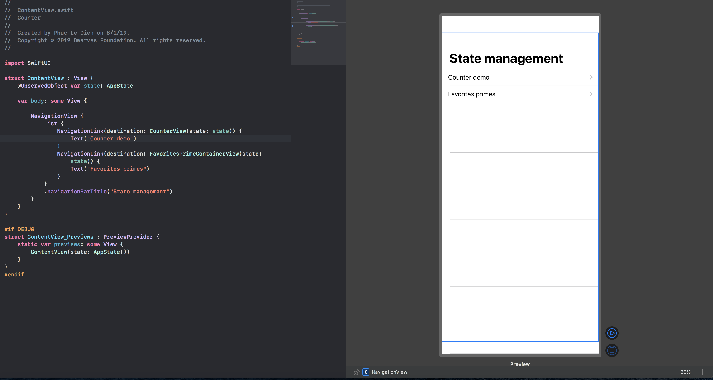
# Canvas view

___

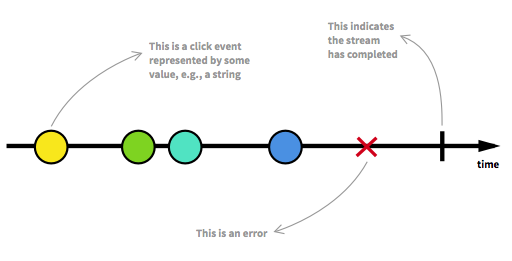
# Combine Framework

___

^Introduce Canvas view and Combine
___

[.code-highlight: all]
[.code-highlight: 4]
[.code-highlight: 5]
[.code-highlight: 5-9]
[.code-highlight: 8]

# Hello World

```Swift
import SwiftUI

struct ContentView: View {
    var body: some View {
        VStack {
            Text("Hello")
            Text("World")
                .bold()
        }
    }
}
```


^DSL syntax

^Opaque return types

^Implicit return

^Function Builder

^View Modifier

___

[.build-lists: true]

# How did they achieve that 🤔

* Implicit return
* Opaque return types
* Function Builder
* View Modifier

^Swift 5.1
___

[.code-highlight: 4]

# Opaque return types

```Swift
import SwiftUI

struct ContentView: View {
    var body: some View {
        VStack {
            Text("Hello")
            Text("World")
                .bold()
        }
    }
}
```

^Returning some View has two important differences compared to just returning View:

^We must always return the same type of view.
Even though we don’t know what view type is going back, the compiler does.

^The first difference is important for performance: SwiftUI needs to be able to look at the views we are showing and understand how they change, so it can correctly update the user interface. If we were allowed to change views randomly, it would be really slow for SwiftUI to figure out exactly what changed – it would pretty much need to ditch everything and start again after every small change.

^The second difference is important because of the way SwiftUI builds up its data using ModifiedContent. 

^What some View lets us do is say “this will return one specific type of view, such as Button or Text, but I don’t want to say what.” So, the hole that View has will be filled by a real view, but we aren’t required to write out the exact long type.

___

[.code-highlight: 5-8]

# Function builder

```Swift
import SwiftUI

struct ContentView: View {
    var body: some View {
        VStack {
            Text("Hello")
            Text("World")
                .bold()
        }
    }
}
```

It could be this 🤨

```Swift
 VStack(
    Text("Hello"),
    Text("World")
        .bold()
 )
 ```

^War on commas, kiểu như Apple rất ghét dấu , =]

___

# @ViewBulder

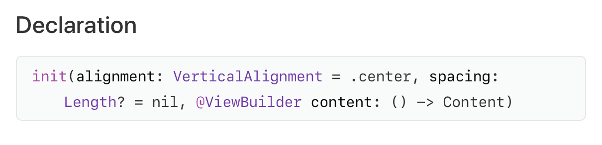

^Function builers sound like they create functions but they can create any value. It’s a function which lets you easily build complex objects

___

```Swift
 VStack {
    Text("Hello")
    Text("World")
        .bold()
}

VStack({
    return ViewBuilder.buildBlock(
        Text("Hello"),
        Text("World")
            .bold()
    )
})
```
___

```Swift
static func buildBlock() -> EmptyView

static func buildBlock<Content>(Content) -> Content

static func buildBlock<C0, C1>(C0, C1) -> TupleView<(C0, C1)>

static func buildBlock<C0, C1, C2>(C0, C1, C2) -> TupleView<(C0, C1, C2)>

static func buildBlock<C0, C1, C2, C3>(C0, C1, C2, C3) -> TupleView<(C0, C1, C2, C3)>

static func buildBlock<C0, C1, C2, C3, C4>(C0, C1, C2, C3, C4) -> TupleView<(C0, C1, C2, C3, C4)>

static func buildBlock<C0, C1, C2, C3, C4, C5>(C0, C1, C2, C3, C4, C5) -> TupleView<(C0, C1, C2, C3, C4, C5)>

static func buildBlock<C0, C1, C2, C3, C4, C5, C6>(C0, C1, C2, C3, C4, C5, C6) -> TupleView<(C0, C1, C2, C3, C4, C5, C6)>

static func buildBlock<C0, C1, C2, C3, C4, C5, C6, C7>(C0, C1, C2, C3, C4, C5, C6, C7) -> TupleView<(C0, C1, C2, C3, C4, C5, C6, C7)>

static func buildBlock<C0, C1, C2, C3, C4, C5, C6, C7, C8>(C0, C1, C2, C3, C4, C5, C6, C7, C8) -> TupleView<(C0, C1, C2, C3, C4, C5, C6, C7, C8)>

static func buildBlock<C0, C1, C2, C3, C4, C5, C6, C7, C8, C9>(C0, C1, C2, C3, C4, C5, C6, C7, C8, C9) -> TupleView<(C0, C1, C2, C3, C4, C5, C6, C7, C8, C9)>
```
___

[.code-highlight: 8]

# View Modifers

```Swift
import SwiftUI

struct ContentView: View {
    var body: some View {
        VStack {
            Text("Hello")
            Text("World")
                .bold()
        }
    }
}
```

^ViewModifier is a modifier that you apply to a view or another view modifier, producing a different version of the original value.

___

# Custom ViewModifier

```Swift
struct PrimaryLabel: ViewModifier {
    func body(content: Content) -> some View {
        content
            .padding()
            .background(Color.red)
            .foregroundColor(Color.white)
            .font(.largeTitle)
    }
}

struct ContentView: View {
    var body: some View {
        Text("Hello, SwiftUI")
            .modifier(PrimaryLabel())
    }
}
```

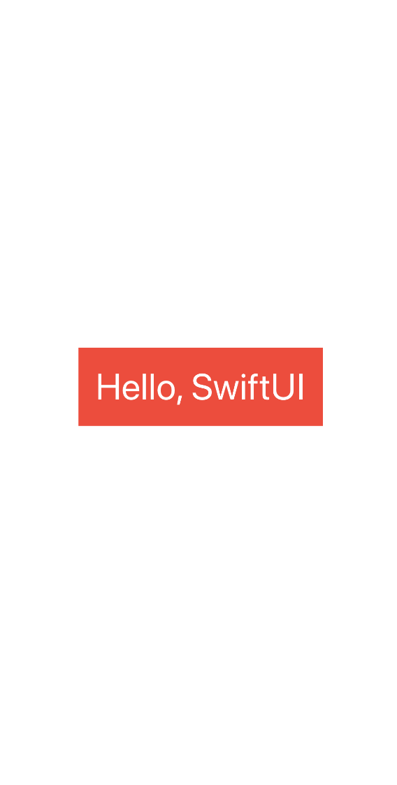

___

# Beautify it 🤩

```Swift
extension View {
    func titleStyle() -> some View {
        self.modifier(PrimaryLabel())
    }
}

struct ContentView: View {
    var body: some View {
        Text("Hello, SwiftUI")
            .titleStyle()
    }
}
```
___

# Some Views and Controls

* List
* TextField
* Button
* Picker
* Toggle
* HStack, ZStack
* ...

See more [HERE](https://developer.apple.com/documentation/swiftui/views_and_controls)


___

# Layout system

___

# Layout process 

1. Parent Proposes Size for Child
2. Child Chooses its Size
3. Parent Places Child in Parent’s Coordinate Space

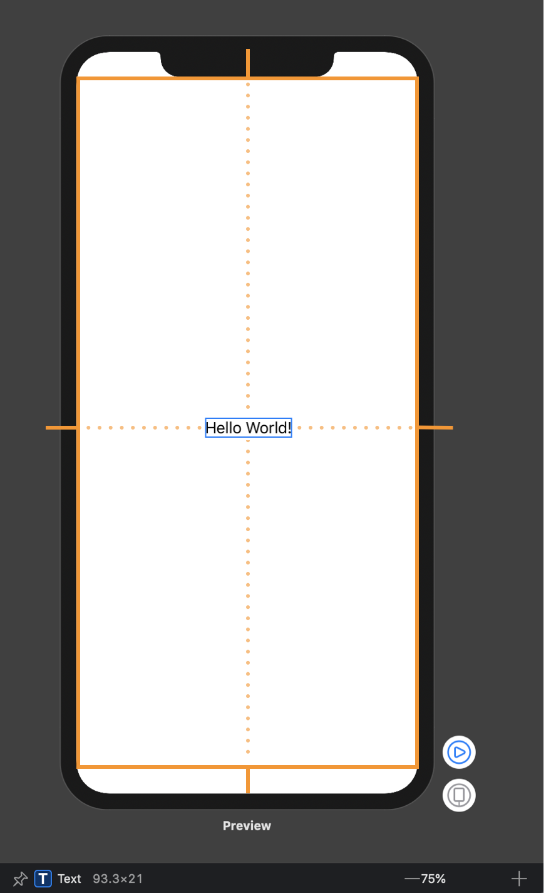

^1. Parent Proposes Size for Child
First, the root view offers the text a proposed size – in this case, the entire safe area of the screen, represeted by an orange rectangle.

^2. Child Chooses its Size
Text only requires that much size to draw its content. The parent has to respect the child's choice. It doesn't stretch or compress the child.

^3. Parent Places Child in Parent’s Coordinate Space
And now the root view has to put the child somewhere, so it puts in right in the middle.

___

# Frame

```Swift
struct Frame: View {
    var body: some View {
        Image("swiftui")
            .border(Color.red)
            .frame(width: 80, height: 80)
            .border(Color.blue)
    }
}
```

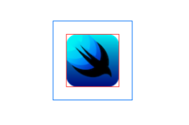

^The image has not changed its size. Why is that? A frame in SwiftUI is not a constraint. Neither it is the current frame or bounds of the view. Frame in SwiftUI is just another view which you can think of like a picture frame.

^By calling Image("swiftui").frame(width: 80, height: 80), SwiftUI creates a new invisible container view with the specified size and positions the image view inside it. The layout process then performs the same steps as we just described previously. 

^The new container view proposes its child, Image, the size 80x80. Image view responds that it is only this big – 60x60, but thank you anyway. The Frame needs to put the image somewhere, so it puts the image in the center – it uses .center alignment by default.

___

[.code-highlight: 6]

```Swift
struct Frame: View {
    var body: some View {
        Image("swiftui")
            .border(Color.red)
            .frame(width: 80, height: 80,
                   alignment: .topLeading)
            .border(Color.blue)
    }
}
```

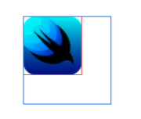

^The alignment parameter specifies this view’s alignment within the frame. The default one is .center, but you can select any of the other available ones

___

[.code-highlight: 4]

```Swift
struct Frame: View {
    var body: some View {
        Image("swiftui")
            .resizable()
            .border(Color.red)
            .frame(width: 80, height: 80)
            .border(Color.blue)
    }
}
```

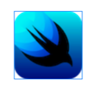

^In SwiftUI, unless you mark an image as resizable, either in the asset catalog or in code, it’s fixed sized. If marked resizable, frame now directly affects the size of the image view:

___

[.code-highlight: 5]

```Swift
struct Frame: View {
    var body: some View {
        Image("swiftui")
            .border(Color.red)
            .frame(width: 40, height: 80)
            .border(Color.blue)
    }
}
```

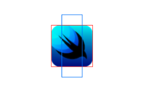

^Like any other view, the child ultimately chooses its own size. It is important to understand this property of the SwiftUI layout system.

___

# Stacks

* HStack - horizontally
* VStack – vertically
* ZStack – back to front

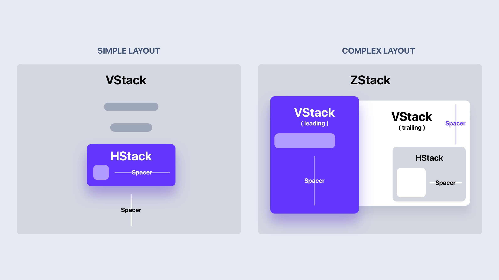

^ HStack group views together horizontally

___

# Stack Layout process 

1. Calculate space for childview after subtract internal spacing

2. Devide the remain space left equally, and propose available size for their child

3. All children have sizes. The stack lines them up with the spacing and aligns them according to the specified alignment.

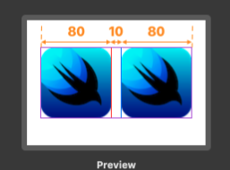

^Step 1. The stack figures out the internal spacing and subtracts it from the size proposed by its parent view.

^Step 2. The stack divides the remaining space into equal parts for each of the remaining views. It then proposes one of those as the size for the least flexible child. Whatever size it claimed, it deducts that from the unallocated space. And then it repeats.

^Step 3. All children have sizes. The stack lines them up with the spacing and aligns them according to the specified alignment. By default, the alignment is – you guessed it – .center. Finally, the stack chooses its own size so that it exactly encloses the children.

___

# Data flow

___

# Property Wrappers

^Property Wrappers feature described in SE-0258 proposal. The main goal here is wrapping properties with logic which can be extracted into the separated struct to reuse it across the codebase.

___

# Example

```Swift
var text = " \n Hello, World! \n\n    "

let trimmedText = text.trimmingCharacters(in: .whitespacesAndNewlines)

print(trimmedText) // "Hello, World!"
```

^Want to make sure a text is alway trimmed before using it
___

# With Property Wrappers

```Swift
@Trimmed
var text = " \n Hello, World! \n\n    "

print(text) // "Hello, World!"
```

___

```Swift
@propertyWrapper
public struct Trimmed {
    private var value: String!
    private let characterSet: CharacterSet
    
    public var wrappedValue: String {
        get { value }
        set { value = newValue.trimmingCharacters(in: characterSet) }
    }
    
    public init(wrappedValue: String) {
        self.characterSet = .whitespacesAndNewlines
        self.wrappedValue = wrappedValue
    }
    
    public init(wrappedValue: String, characterSet: CharacterSet) {
        self.characterSet = characterSet
        self.wrappedValue = wrappedValue
    }
}
```

___

[.build-lists: true]

# Property Wrappers in **SwiftUI**

* @State
* @Binding
* @ObservedObject
* @EnvironmentObject
* @Environment

___

# @State

```Swift
struct ProductsView: View {
    let products: [Product]

    @State private var showFavorited: Bool = false

    var body: some View {
        List {
            Button(
                action: { self.showFavorited.toggle() },
                label: { Text("Change filter") }
            )

            ForEach(products) { product in
                if !self.showFavorited || product.isFavorited {
                    Text(product.title)
                }
            }
        }
    }
}
```

^@State is a Property Wrapper which we can use to describe View’s state. SwiftUI will store it in special internal memory outside of View struct. Only the related View can access it. As soon as the value of @State property changes SwiftUI rebuilds View to respect state changes. Here is a simple example.

___

# @Binding

```Swift
struct FilterView: View {
    @Binding var showFavorited: Bool

    var body: some View {
        Toggle(isOn: $showFavorited) {
            Text("Change filter")
        }
    }
}

struct ProductsView: View {
    let products: [Product]

    @State private var showFavorited: Bool = false

    var body: some View {
        List {
            FilterView(showFavorited: $showFavorited)

            ForEach(products) { product in
                if !self.showFavorited || product.isFavorited {
                    Text(product.title)
                }
            }
        }
    }
}
```

^@Binding provides reference like access for a value type. Sometimes we need to make the state of our View accessible for its children. But we can’t simply pass that value because it is a value type and Swift will pass the copy of that value. And this is where we can use @Binding Property Wrapper.

___

# @ObservedObject

```Swift
import Combine

final class PodcastPlayer: ObservableObject {
    let objectWillChange = PassthroughSubject<Void, Never>()

    private(set) var isPlaying: Bool = false {
        willSet { objectWillChange.send() }
    }

    func play() {
        isPlaying = true
    }

    func pause() {
        isPlaying = false
    }
}
```

^@ObservedObject work very similarly to @State Property Wrapper, but the main difference is that we can share it between multiple independent Views which can subscribe and observe changes on that object, and as soon as changes appear SwiftUI rebuilds all Views bound to this object. Let’s take a look at an example.

^Remember, we can share ObservableObject between multiple views, that’s why it must be a reference type/class.

___

## Even shorter 🤩

```Swift
import Combine

final class PodcastPlayer: ObservableObject {
    
    @Published private(set) var isPlaying: Bool = false

    func play() {
        isPlaying = true
    }

    func pause() {
        isPlaying = false
    }
}
```

^And now this is where a bit of compiler magic begins 🎩✨. By default, Swift compiler synthesizes an objectWillChange publisher that emits the value before any of its @Published properties changes 🤯.

^If you didn’t want to rely on the compiler magic, all you had to do was implement objectWillChange manually.

___

```Swift
struct EpisodesView: View {
    @ObservedObject var player: PodcastPlayer
    let episodes: [Episode]

    var body: some View {
        List {
            Button(
                action: {
                    if self.player.isPlaying {
                        self.player.pause()
                    } else {
                        self.player.play()
                    }
            }, label: {
                    Text(player.isPlaying ? "Pause": "Play")
                }
            )
            ForEach(episodes) { episode in
                Text(episode.title)
            }
        }
    }
}
```

___

[.code-highlight: 12-16]

## @EnvironmentObject

```Swift
class SceneDelegate: UIResponder, UIWindowSceneDelegate {

    var window: UIWindow?

    func scene(_ scene: UIScene, willConnectTo session: UISceneSession, options connectionOptions: UIScene.ConnectionOptions) {
        let window = UIWindow(frame: UIScreen.main.bounds)
        let episodes = [
            Episode(id: 1, title: "First episode"),
            Episode(id: 2, title: "Second episode")
        ]

        let player = PodcastPlayer()
        window.rootViewController = UIHostingController(
            rootView: EpisodesView(episodes: episodes)
                .environmentObject(player)
        )
        self.window = window
        window.makeKeyAndVisible()
    }
}
```

^Instead of passing ObservableObject via init method of our View we can implicitly inject it into Environment of our View hierarchy. By doing this, we create the opportunity for all child Views of current Environment access this ObservableObject.

___

```Swift
struct EpisodesView: View {
    @EnvironmentObject var player: PodcastPlayer
    let episodes: [Episode]

    var body: some View {
        List {
            Button(
                action: {
                    if self.player.isPlaying {
                        self.player.pause()
                    } else {
                        self.player.play()
                    }
            }, label: {
                    Text(player.isPlaying ? "Pause": "Play")
                }
            )
            ForEach(episodes) { episode in
                Text(episode.title)
            }
        }
    }
}
```

^As you can see, we have to pass PodcastPlayer object via environmentObject modifier of our View. By doing this, we can easily access PodcastPlayer by defining it with @EnvironmentObject Property Wrapper. @EnvironmentObject uses dynamic member lookup feature to find PodcastPlayer class instance in the Environment, that’s why you don’t need to pass it via init method of EpisodesView. The Environment is the right way of Dependency Injection in SwiftUI. It works like magic.

___

#[Fit] **@ObservedObject** and **@EnvironmentObject** 🤔

<br>

#[Fit] A -> B -> C -> D

^ Có 1 flow gồm 4 màn hình A, B, C, D, giả sử D muốn có dữ liệu từ màn hình A thì phải làm sao? Cách thông thường là ta sẽ sử dụng @ObservedObject truyền lần lượt qua B rồi C rồi đến D. Nhưng vậy thì sẽ hơi bất tiện, cũng như là sẽ có những màn hình không cần xài đến dữ liệu của A.

^ Thay vào đó, ta sẽ sử dụng @EnvironmentObject thì lúc này tất cả các màn hình sẽ cùng share dữ liệu này, và sử dụng nếu cần thiết.
___

# @Environment

```Swift
struct CalendarView: View {
    @Environment(\.calendar) var calendar: Calendar
    @Environment(\.locale) var locale: Locale
    @Environment(\.colorScheme) var colorScheme: ColorScheme

    var body: some View {
        return Text(locale.identifier)
    }
}
```

^SwiftUI already has an Environment populated with system-wide settings. We can easily access them with @Environment Property Wrapper.

^As soon as Locale, Calendar or ColorScheme of the system change, SwiftUI recreates our CalendarView.

___

#[Fit] Architecture 🏗

___

# MVVM

```Swift
struct SearchView: View {
    @ObservedObject var viewModel: SearchViewModel

    var body: some View {
        VStack {
            TextField("Search", text: $viewModel.query)
            List(viewModel.songs) {
                Text($0.name)
            }
        }
    }
}

final class SearchViewModel: ObservableObject {
    @Published var query: String = ""
    @Published private(set) var songs: [Song] = []
    private var cancellable: AnyCancellable?

    init(service: SearchService) {
        cancellable = $query
            .throttle(for: .milliseconds(300), scheduler: DispatchQueue.main, latest: true)
            .removeDuplicates()
            .flatMap {
                service.searchSongs(query: $0).catch {
                    _ in Just([])
                }
            }
            .receive(on: DispatchQueue.main)
            .sink { [unowned self] in self.songs = $0 }
    }
}
```

___

# Redux

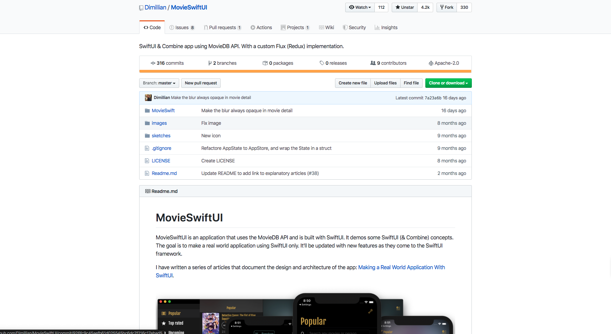

### Check [here](https://github.com/Dimillian/MovieSwiftUI)

___

# UIKit ? SwiftUI

___

# [Fit] SwiftUI doesn't support your favorite component? 😞

___

## DIY 😴

```Swift
struct TextView: UIViewRepresentable {
    @Binding var text: String

    func makeUIView(context: Context) -> UITextView {
        return UITextView()
    }

    func updateUIView(_ uiView: UITextView, context: Context) {
        uiView.text = text
    }
}

struct ContentView : View {
    @State var text = ""

    var body: some View {
        TextView(text: $text)
            .frame(minWidth: 0, maxWidth: .infinity, minHeight: 0, maxHeight: .infinity)
    }
}

```

___

# [fit] Some thoughs 🤔

___ 

[.build-lists: true]

# Limited

* Limited API coverage
* Limited adoption
* Limited support

^Limited API coverage:
^SwiftUI is that it does not currently have the same broad API coverage as UIKit.

^For example, if you want to show items in a grid you would use UICollectionView in UIKit, but SwiftUI has no equivalent. Or if you wanted to let the user enter multiline text you would use UITextView in UIKit, but SwiftUI has no equivalent either.

^Limited adoption
^SwiftUI was only announced at WWDC2019, and is available in iOS 13 devices or later. This immediately means that:

^- Almost every app written to date uses UIKit.
^- Any app that needs to support iOS n-1 or n-2 (e.g. iOS 12 and iOS 11) cannot even begin to switch to SwiftUI for a year or more.

^ Limited support
^UIKit has been around over ten years now, which means: 

^- Almost every problem you might face has probably already been faced and solved by others
^- There are lots of libraries out there that provide extensions and customizations.

___ 

# Implicit wraps

```Swift
VStack {
    Text("abc")
        .bold()
        .padding(.all)
}
```

^`.bold()` alters Text, but `.padding()` wraps it in another view, changing the return type of the whole expression along the way. Compare that with VStack, which wraps its children explicitly. Why make the distinction?

___

# why not this?

```Swift
VStack {
    Padding {
        Text("abc").bold()
    }
}
```

___

# Child privacy invasion

```Swift
NavigationView {
    List {...}
        .navigationBarTitle(Text("Rooms"))
}
```

^Some things are probably just plain mistakes (very funny though). E.g. NavigationView takes its properties not from its constructor or via modifiers, but instead from the properties of its first child. WHY?

___

# Smart defaults

```Swift
HStack {
    Text("★★★★★")
    Text("Avocado Toast).font(.title)
    ...
}
```

See the padding here? No? But look at the picture!

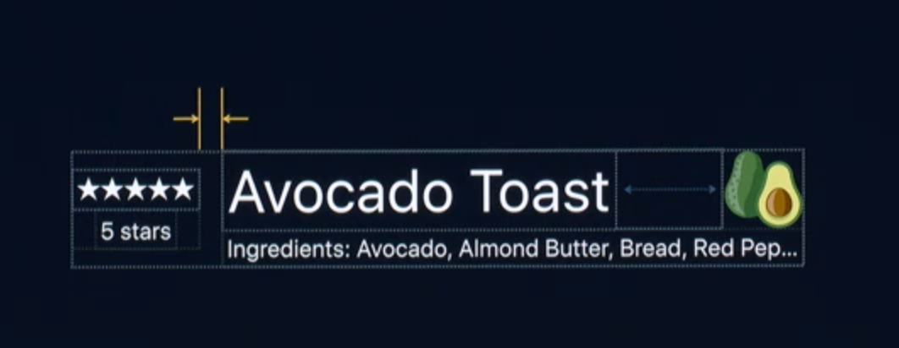

___ 

# Demo

___

## **Thank you!**
### @phucledien
