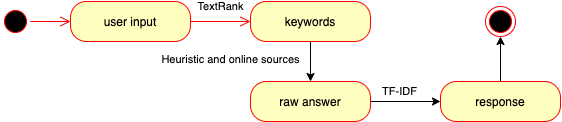
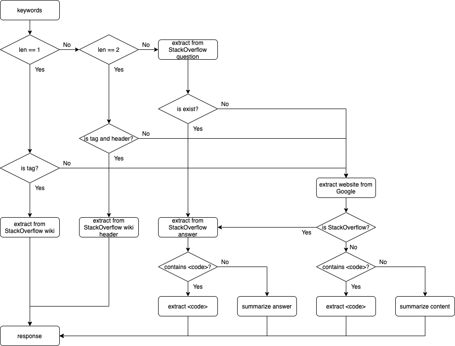
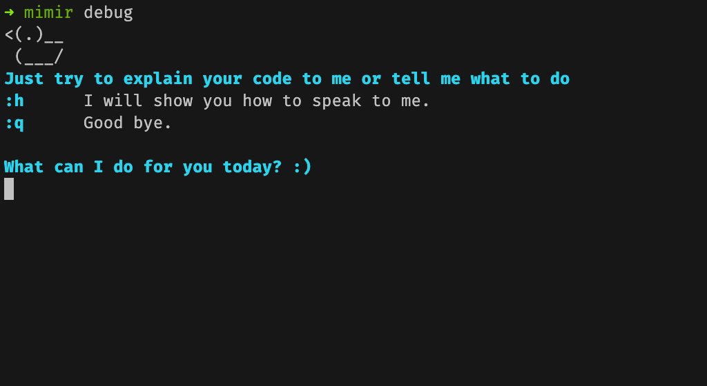

# Terminal assistant

## Introduction
When coding, developers look for references constantly. "What does this snippet of code do?", "How to implement something in this programming language?", etc. According to the StackOverflow blog [[1]](#ref-1), the page itself saw more than 9 billion pageviews in 2019. There is also an unrecorded amount of views on other developer blogs and tutorials online. That was an enormous amount of developers searching for supports.

Terminal assistant is a tool that brings the supports that developers searching for to your terminal. Instead of looking for answers on web browsers, you can ask this 'assistant' on your terminal and it will answer your confusion when you are coding.

The name of this tool, 'Mimir' is based on a character in the game *God of war* &trade; (2018). While Mimir hanging from the hip of Kratos and guiding him to the world of Norse Gods with his knowledge, this tool will hang from your terminal guide you to the world of programming.

## Description
This tool is a Command Line Interface (CLI) tool, which means it runs on your terminal. It takes your question as an input e.g. "What is a stack?", then it looks for the answer online, parses the answer, and prints the answer on your terminal.

Additionally, this tool can be served as a rubber duck debugger on your terminal. You can 'chat' with this assistant to explain your code and it will patiently 'listen' to your explanation. Sometimes, it will respond with some words of encouragement.

## Related works
There is a wonderful work on the idea of the CLI coding answer called *howdoi* (https://github.com/gleitz/howdoi), which received 8.4k stars on Github. This tool embraced the problem of searching for an answer with the help of using common online search engines (Google, Bing, and Duckduckgo). It searches the users' questions using these engines, then it gets the HTML content of the first web result and parses the answer from the HTML content based on HTML and returns the answer to the user.

This tool is awesome (it recently evolving into extensions on popular code editors), however, it still suffers from high false positive, as it depends on users' questions (maybe too rambling) and search engines. Our works aim to counter this with the use of Artificial Intelligence (AI) approaches, specifically, heuristic and language processing approaches.

## Challenge
The most critical criteria for this tool is time performance. Developers expected their answer must be answered in seconds, otherwise, they just need to use the web browsers to look for an answer. However, machine learning and word embedding approaches are not very time efficient and quite large (a few hundred MB) for a CLI tool, therefore we are limited with small and simple language processing approaches.

The second constraint is precision. We expect the tool to provide the most suitable and relevant answers available. Therefore pre-processing the users' input and summarize the response is essential. To sum up, the significant challenge of this tool is to balance time efficiency and precision.

## Implementation

### Programming language and frameworks
When involving AI, mostly the idea of using `Python` popped out immediately. `Python` is great at AI programming, especially in machine learning, as it has a variety of optimized libraries on calculations suitable for machine learning (e.g. *NumPy, TensorFlow,, sklearn, etc.*). However, this tool is not AI-heavy, as it only uses small heuristic and language processing approaches. This tool is network heavy, as it rapidly collects answers from the Internet. Thus, We choose `Go` as the programming language, which is great at handle network requests. Furthermore, it is more fun to implement AI algorithms from scratch instead of using pre-defined libraries.

For the CLI framework, We are using *Cobra* (https://github.com/spf13/cobra). This framework is great for creating CLI applications.

### Application flow


The tool takes the users' input and extracted its keywords using the *TextRank* algorithm. Then, the keywords are pushed through a layer of heuristic function to determine where it should get the answer and how to parse the answer. The answer was then summarised using the *TF-IDF* algorithm and formatted and returned to users.

### TextRank

*TextRank* [[2]](#ref-2) is a keyword extractor algorithm based on *PageRank* [[3]](#ref-3). Theoretically, *TextRank* maps the text corpus (mostly with stop words (preposition, conjunctions, etc..) removed) into a graph. Each node in the graph is given a score. Then, through multiple loops, the score of each node is recalculated as the sum of the weighted score of the neighbor nodes. The loops stop after a pre-defined number of loops or when the scores are saturated.

For example, the sentence `The quick brown fox jumps over the lazy dog`, after removing stop words (resulting in `quick brown fox jumps over lazy dog`) can be mapped into the graph below, using a window-based mapping approach, as presented in the original paper. Additionally, the word embedding approach can be used to map the text into a different graph, but this approach is resource-heavy, so we are going to stick with the original window-based approach.


The window-based mapping algorithm is implemented by shifting a window with a pre-defined size (4 in this example). Each word in this window is then mapped into a fully connected graph. This algorithm has a drawback that the first and last words have the least connection, therefore, lowering their weighted score, but since the developers' questions are usually short (less than 10 words), this problem is not significantly affecting the performance.

Initially, all node scores are assigned as 1. After each loop, the scores are updated. For example, node `quick` has four neighbors (`fox`, `brown`, `jumps`). `fox` has four connections, `brown` has four connections, `jumps` has five connections, therefore the weight of each nodes are 1/4, 1/4, and 1/5 respectively. The new score of `quick` is 1/4\*1 (`fox`) + 1/4\*1(`brown`) +1/5\*1 (`jumps`) = 0.7.

Applicably, after removing the stop words, the text is mapped into a &mode=inline) matrix, with  is the length of text. This matrix is called *weight matrix*, with each weight value is calculated as described above. For example, the *weight matrix* for the above sentence is:

|     |quick|brown|fox|jumps|over|lazy|dog|
|-----|-----|-----|---|-----|----|---|----|
|quick|0|0.25|0.25|0.2|0|0|0|
|brown|0.33|0|0.25|0.2|0.2|0|0|
|fox  |0.33|0.25|0|0.2|0.2|0|0|
|jumps|0.33|0.25|0.25|0|0.2|0.33|0|
|over |0|0.25|0.25|0.2|0|0.33|0.5|
|lazy |0|0|0|0.2|0.2|0|0.5|
|dog  |0|0|0|0|0.2|0.33|0|

The score of each word in the sentence is represented as a tranposed vector with shage &mode=inline). Then, the new *TextRank* score is the result of matrix multiplication:

%0A%5Ctimes%0A%5Cleft(%5Cbegin%7Barray%7D%7Bcc%7D%20%0A1%5C%5C%0A1%5C%5C%0A1%5C%5C%0A1%5C%5C%0A1%5C%5C%0A1%5C%5C%0A1%0A%5Cend%7Barray%7D%5Cright)%0A%3D%0A%5Cleft(%5Cbegin%7Barray%7D%7Bcc%7D%20%0A0.7%5C%5C%0A0.98%5C%5C%0A0.98%5C%5C%0A1.36%5C%5C%0A1.53%5C%5C%0A0.9%5C%5C%0A0.53%0A%5Cend%7Barray%7D%5Cright))

In this project, the *TextRank* algorithm is mapped with a window-based algorithm with window size 4, and the score calculation loop number is 10. These are reasonable values with small texts (less than 10 words). We also define the keywords for the text are the words with score > 1 (In this example, `jumps` and `over` are keywords).

### Heuristic layer
This feature is the heart of the tool to achieve better precision. In this project, we get the answers from three sources: StackOverflow Wiki, StackOverflow Question, and Google. We implement the heuristic function based on the number of keywords.

If there is only one keyword, we check if the keyword is a StackOverflow tag or not. If it is a tag, then we extract two most important sentences from the StackOverflow Wiki with the provided tag, using *TextRank* algorithm on the sentence level (similar to the word level explained above, but using paragraph as corpus and sentences as scalar). If it is not a tag, we extract the first searched website from Google using the keyword. If the website belongs to StackOverflow, we extracted the HTML content answer from that website, otherwise, we extract the full HTML content of the website. Then we looking for tag `<code>` in the content. If the tag is not found, we extract the two most important sentences, using *TextRank*.

If there are two keywords, we check if any of those is a StackOverflow tag and if the other is similar to any header of the StackOverflow Wiki with that tag. If two conditions are met, we extracted the content from that header of the StackOverflow Wiki, otherwise, we are using Google to get the answer as mentioned above.

If there are more than two keywords, we are searching StackOverflow Question to find if the problem is answered. If yes, we extracted content from the answer, with tag `<code>` then summarize content if the tag is not found. Else we are using Google, the same as above.

The heuristic function is described below:



### TF-IDF
In the case of there are many tags `<code>`, we chose the two most important tags' content, using Term frequency - inverse document frequency (TF-IDF) [[4]](#ref-4) algorithm.

TF-IDF s a statistical measure that evaluates how relevant a word is to a document in a collection of documents. This is done by multiplying two metrics: how many times a word appears in a document (term frequency), and the inverse document frequency of the word across a set of documents.

TF-IDF works by increasing proportionally to the number of times a word appears in a document but is offset by the number of documents that contain the word. So, words which are common in every document, such as *this, a/an, if, etc.* rank low even though they may appear many times since they don’t mean much to that document in particular.

TF-IDF for a word in a document is calculated by multiplying two different metrics:

%20%3D%20tf(t,d)%20%5Ctimes%20idf(t,%20D))

The term frequency of a word in a document. There are several ways of calculating this frequency, with the simplest being a raw count of instances a word appears in a document. Then, there are ways to adjust the frequency, by the length of a document, or by the raw frequency of the most frequent word in a document:

%20%3D%20%5Clog%20(1%20%2B%20freq(t,%20d)))

The inverse document frequency of the word across a set of documents. This means, how common or rare a word is in the entire document set. The closer it is to 0, the more common a word is. This metric can be calculated by taking the total number of documents, dividing it by the number of documents that contain a word, and calculating the logarithm:

%20%3D%20%5Clog%20%5Cfrac%7BN%7D%7Bcount(d%20%5Cin%20D%3A%20t%20%5Cin%20d)%7D)

For example, we extracted four tags `<code>` and need to determine the two most important:
```t
T1: git push origin tagname

T2: git push delete origin tagname

T3: git push origin refs tag tagname

T4: git tag delete tagname
```

We calculated the TF-IDF as follow:

| |tf1|tf2|tf3|tf4|df|idf|
|-|--|--|--|--|--|---|
|git|1|1|1|1|4|log(4/4)=0|
|push|1|1|1|0|3|log(4/3)=0.12|
|origin|1|1|1|0|3|log(4/3)=0.12|
|tagname|1|1|1|1|4|log(4/4)=0|
|delete|0|1|0|1|2|log(4/2)=0.3|
|refs|0|0|1|0|1|log(4/1)=0.6|
|tag|0|0|1|1|2|log(4/2)=0.3|

Then we multiplied TF with IDF:

| |tfidf1|tfidf2|tfidf3|tfidf4|
|-|--|--|--|--|
|git|0|0|0|0|
|push|0.12|0.12|0.12|0|
|origin|0.12|0.12|0.12|0|
|tagname|0|0|0|0|
|delete|0|0.3|0|0.3|
|refs|0|0|0.6|0|
|tag|0|0|0.3|0.3|
|**SUM**|0.24|0.54|1.24|0.6|

`T3: git push origin refs tag tagname` and `T4: git tag delete tagname` are then the extracted response to be returned.

### Rubber duck debugger
This feature is simple. We just print what the user is typing on the terminal. After each line is printed, we will randomly decide to print some words of encouragement (mostly Mimir line in the game *God of War* &trade; (2018)) or not.



## Achievement and limitation
The tool returned good results to the questions within a reasonable time (around 1-2s). However, formatted responses are not too precise. In other words, the responses are to narrow, as the HTML content parsing is still simple. In machine learning terms, the model achieved high recall but not-so-high precision. Making the parser more complex means trade-off with performance. Still, the current response and performance are acceptable.


## References
[1] <a id="ref-1"></a> https://stackoverflow.blog/2019/01/18/state-of-the-stack-2019-a-year-in-review/  
[2] <a id="ref-2"></a> "Textrank: Bringing order into text", R Mihalcea and P Tarau (2004)  
[3] <a id="ref-3"></a> "The PageRank citation ranking: Bringing order to the web", L Page, S Brin, R Motwani and T Winograd (1999)  
[4] <a id="ref-4"></a> "A probabilistic justification for using tf x idf term weighting in information retrieval", D Hiemstra (2000)