# **Mimir**

A CLI assistant for developers

---

# Flow

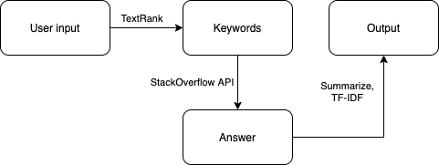

---

# textRank

based on pageRank, but for text.
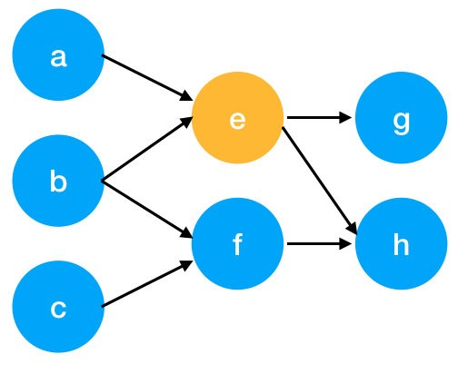

---

# textRank

```text
The quick brown fox jumps over the lazy dog.
```

---

# textRank

```text
[The quick brown fox] jumps over the lazy dog.
```
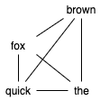

---

# textRank

```text
The [quick brown fox jumps] over the lazy dog.
```
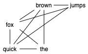

---

# textRank

```text
The quick [brown fox jumps over] the lazy dog.
```
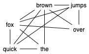

---

# textRank

```text
The quick brown [fox jumps over the] lazy dog.
```
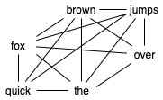

---

# textRank

```text
The quick brown fox [jumps over the lazy] dog.
```
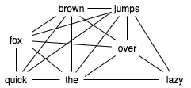

---

# textRank

```text
The quick brown fox jumps [over the lazy dog].
```
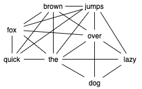

---

# textRank

```text
The quick brown fox jumps [over the lazy dog].
```
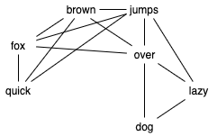

---

# textRank

|     |quick|brown|fox|jumps|over|lazy|dog|
|-----|-----|-----|---|-----|----|---|----|
|quick|0|1|1|1|0|0|0|
|brown|1|0|1|1|1|0|0|
|fox  |1|1|0|1|1|0|0|
|jumps|1|1|1|0|1|1|0|
|over |0|1|1|1|0|1|1|
|lazy |0|0|0|1|1|0|1|
|dog  |0|0|0|0|1|1|0|

---

# textRank

|     |quick|brown|fox|jumps|over|lazy|dog|
|-----|-----|-----|---|-----|----|---|----|
|quick|0|0.25|0.25|0.2|0|0|0|
|brown|0.33|0|0.25|0.2|0.2|0|0|
|fox  |0.33|0.25|0|0.2|0.2|0|0|
|jumps|0.33|0.25|0.25|0|0.2|0.33|0|
|over |0|0.25|0.25|0.2|0|0.33|0.5|
|lazy |0|0|0|0.2|0.2|0|0.5|
|dog  |0|0|0|0|0.2|0.33|0|

---

# textRank

$$
\left(\begin{array}{cc} 
0 & 0.25 & 0.25 & 0.2 & 0 & 0 & 0\\
0.33 & 0 & 0.25 & 0.2 & 0.2 & 0 & 0\\
0.33 & 0.25 & 0 & 0.2 & 0.2 & 0 & 0\\
0.33 & 0.25 & 0.25 & 0 & 0.2 & 0.33 & 0\\
0 & 0.25 & 0.25 & 0.2 & 0 & 0.33 & 0.5\\
0 & 0 & 0 & 0.2 & 0.2 & 0 & 0.5\\
0 & 0 & 0 & 0 & 0.2 & 0.33 & 0\\
\end{array}\right)
*
\left(\begin{array}{cc} 
1\\
1\\
1\\
1\\
1\\
1\\
1
\end{array}\right)
=
\left(\begin{array}{cc} 
0.7\\
0.98\\
0.98\\
1.36\\
1.53\\
0.9\\
0.53
\end{array}\right)
$$ 

---

# textRank

$$
\left(\begin{array}{cc} 
0 & 0.25 & 0.25 & 0.2 & 0 & 0 & 0\\
0.33 & 0 & 0.25 & 0.2 & 0.2 & 0 & 0\\
0.33 & 0.25 & 0 & 0.2 & 0.2 & 0 & 0\\
0.33 & 0.25 & 0.25 & 0 & 0.2 & 0.33 & 0\\
0 & 0.25 & 0.25 & 0.2 & 0 & 0.33 & 0.5\\
0 & 0 & 0 & 0.2 & 0.2 & 0 & 0.5\\
0 & 0 & 0 & 0 & 0.2 & 0.33 & 0\\
\end{array}\right)
*
\left(\begin{array}{cc} 
0.7\\
0.98\\
0.98\\
1.36\\
1.53\\
0.9\\
0.53
\end{array}\right)
=
\left(\begin{array}{cc}
0.762\\
1.054\\
1.054\\
1.324\\
1.324\\
0.843\\
0.603\\
\end{array}\right)
$$ 

---

# textRank

|quick|brown|fox |jumps|over|lazy|dog |
|-----|-----|----|-----|----|----|----|
|0.79 |1.05 |1.05|1.31 |1.31|0.79|0.53|

---

# Flow


---

# Answer

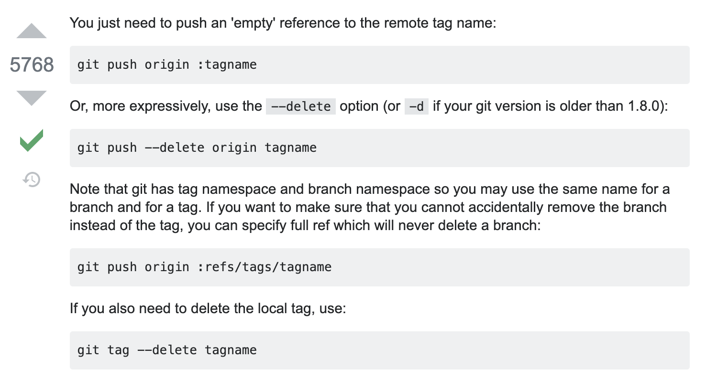

---

# TF-IDF

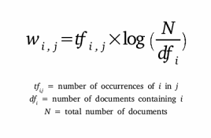

---

# TF-IDF

```t
T1: git push origin tagname

T2: git push delete origin tagname

T3: git push origin refs tag tagname

T4: git tag delete tagname
```

---

# TF-IDF

| |tf1|tf2|tf3|tf4|df|idf|
|-|--|--|--|--|--|---|
|git|1|1|1|1|4|log(4/4)=0|
|push|1|1|1|0|3|log(4/3)=0.12|
|origin|1|1|1|0|3|log(4/3)=0.12|
|tagname|1|1|1|1|4|log(4/4)=0|
|delete|0|1|0|1|2|log(4/2)=0.3|
|refs|0|0|1|0|1|log(4/1)=0.6|
|tag|0|0|1|1|2|log(4/2)=0.3|

---

# TF-IDF

| |tfidf1|tfidf2|tfidf3|tfidf4|
|-|--|--|--|--|--|---|
|git|0|0|0|0|
|push|0.12|0.12|0.12|0|
|origin|0.12|0.12|0.12|0|
|tagname|0|0|0|0|
|delete|0|0.3|0|0.3|
|refs|0|0|0.6|0|
|tag|0|0|0.3|0.3|

---

# TF-IDF

| |tfidf1|tfidf2|tfidf3|tfidf4|
|-|--|--|--|--|--|---|
|**SUM**|0.24|0.54|1.24|0.6|

---

# Response

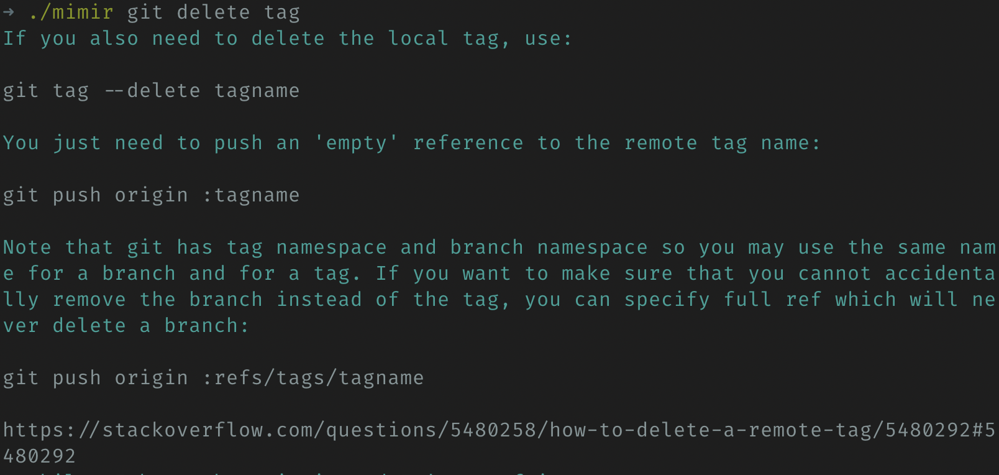

---

# Related works

https://github.com/gleitz/howdoi


---

# Thank you