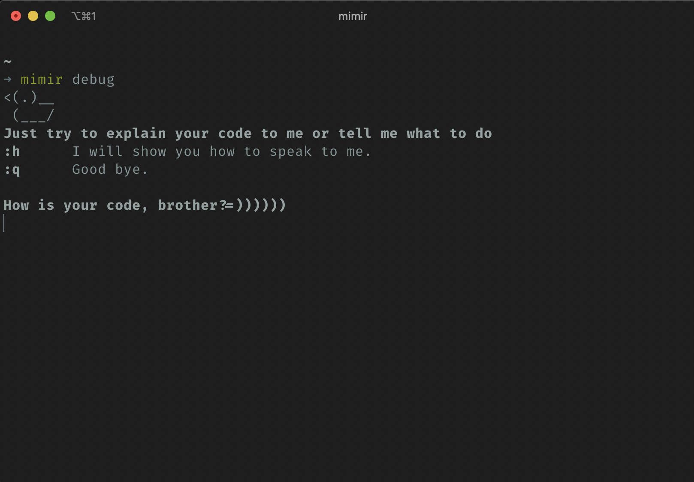

# Mimir

> I know every corner of these lands, every language spoken, every war waged, every deal ever struck. They call me… Mimir! —smartest man alive, and I have the answer to your every question.
> 
> -–Mimir, introducing himself to Kratos, *God of War* (2018)

An advisor for your development process.

## Usage

### Advisor Mimir  


### Ruber duck debugging (or Mimir debugging)  


## Install

```
$ brew tap mkhoi1998/mimir
$ brew install mimir
```