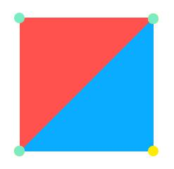
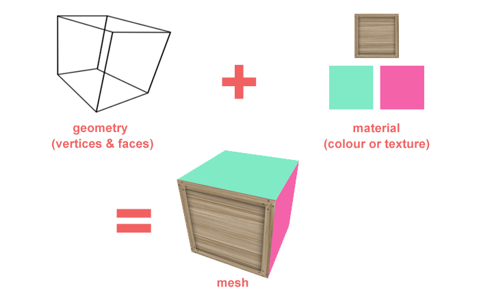
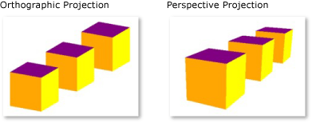

# `three.js` Basic Concepts

## Introduction
`three.js` is a wrapper/abstraction of WebGL, make it easier to use. That said, it has no official definition. The author ([mr.doob](https://github.com/mrdoob)) refers to it as something he created to simply "make what he wants".

To quickly get an idea of `three.js` has to offer, you can visit their example directory [here](https://threejs.org/examples/#webgl_animation_cloth).

### What about WebGL?
WebGL is an API. It lets you access a computer’s specialised graphics hardware using JavaScript, and render the output to a webpage in a regular old `canvas` element.

You can read more about WebGL on their [offical docs](https://www.khronos.org/webgl/wiki/Main_Page).

## Constitution of a `three.js` scene

Basically, `three.js` scene is like a movie scene. You need the space, the objects, the light, the sound, the camera, etc. They all combine together, creating a scene.

I will not try to include everything here because it would be tenuous - We don't want a lot of new concepts without any proper insight. Instead, I'll just give you an idea of the most basic things ThreeJS has to offer:

- [Vertext and Segment](#vertex-segment)
- [Mesh, Geometry and Material](#mesh-geometry-material)
- [Camera](#camera)
- [Lighting](#lighting)

Now let's go from the small things up:

### <a id="vertext-segment">Vertex and Segment</a>

To create a shape, we need at least 3 vertices. That's why the smallest "building shape" in `three.js` is the **triangle**. It's also called a **segment**. Triangles can make up every object. The more triangles you use, the more detailed it become:

 [<a href="https://www.cs.cmu.edu/afs/cs/academic/class/15294-s15/lectures/stl/bunny-resolutions.jpg">image source</a>]

Take a look at the following image:

It has 4 vertices, creating 2 different segments with no overlapping diagonal line. This shape can now be used as, for example, one **face** of a box.

### <a id="mesh-geometry-material">Mesh, Geometry and Material</a>

A **mesh** in `three.js` is an object, created by combining **geometry** and **material**. Think of a wooden box. Its geometry would be **box**, while its material would be **wooden**.

In other words:

- Geometry: A collection of vertices and faces
- Material: The material you want the mesh to be made in

### <a id="camera">Camera</a>

We have 2 main types of cameras: `PerspectiveCamera` and `OrthographicCamera`.

"...A perspective camera is how we see the real world. If we take a look at the things around us, they have depth and we can judge their distance. Imagine looking at a very long road. It will appear to get narrower as it goes further into the distance. This is due to perspective.

An orthographic camera however removes this sense of perspective. Objects are drawn without perspective distortion..."

You can refer to [this](https://answers.unity.com/questions/1218955/comparing-orthographic-and-perspective-cameras.html) for a more detailed explanation.

We'll be using `PerspectiveCamera` for the app.

### <a id="lighting">Lighting</a>

`three.js` provides lighting objects such as `SpotLight`, `PointLight`, `AmbientLight`, etc. for every use-case. I think some examples would be better in this case:

- [Point Light](https://threejs.org/examples/?q=Light#webgl_lights_pointlights)
- [Spot Light](https://threejs.org/examples/?q=Light#webgl_lights_spotlights)
- [Rect Area Light](https://threejs.org/examples/?q=Light#webgl_lights_rectarealight)
- ...

---

With the above-mentioning elements combined, user can create 3D scenes in their own impression. Below are some amazing projects created with `three.js`:

  
  
  
  
  
  
  
  
  
  
  
  
  
  
  

_Disclaimer: I copied the above example projects from the office [`react-three-fiber` repo](https://github.com/react-spring/react-three-fiber)._

## Other things I want to mention...
... but won't delve deep into.

### [`react-three-fiber`](<(https://github.com/react-spring/react-three-fiber)>)

A powerful React renderer for `three.js`

- Component-based: declarative, reusable
- Built-in helpers and hooks for easier manipulation
- ...

A good starting guide can be found [here](https://alligator.io/react/react-with-threejs/).

### [dat.GUI](https://github.com/dataarts/dat.gui)

A lightweight graphical user interface for changing variables in JavaScript.

### Use of shaders
I was going to include shader, but that's honestly out of my league right now. It's a world of its own. I will try to follow up with another tech radar project, if possible.

## Other References

- https://threejs.org/docs/
- https://humaan.com/blog/web-3d-graphics-using-three-js/
