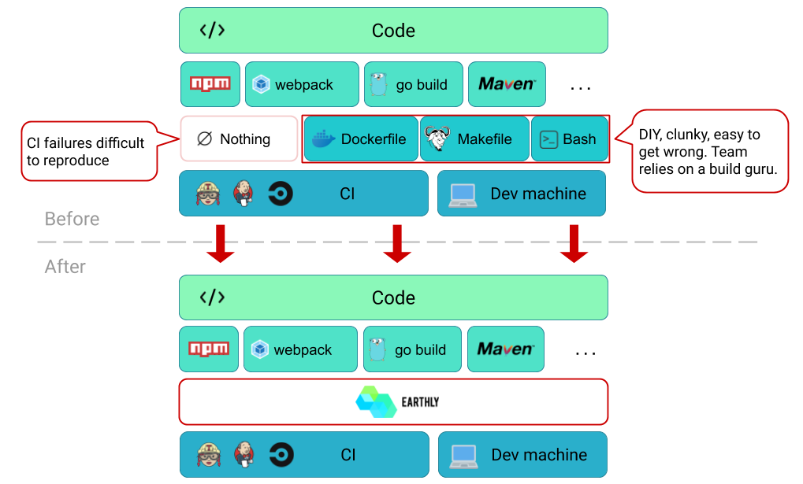
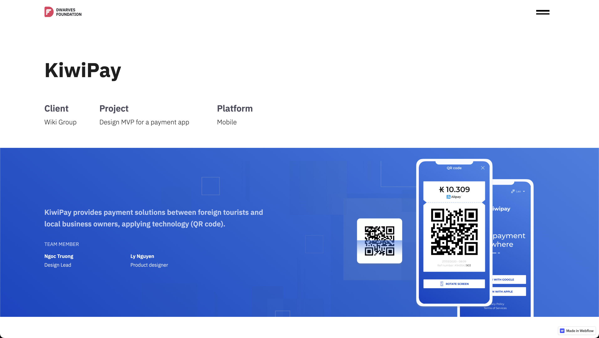
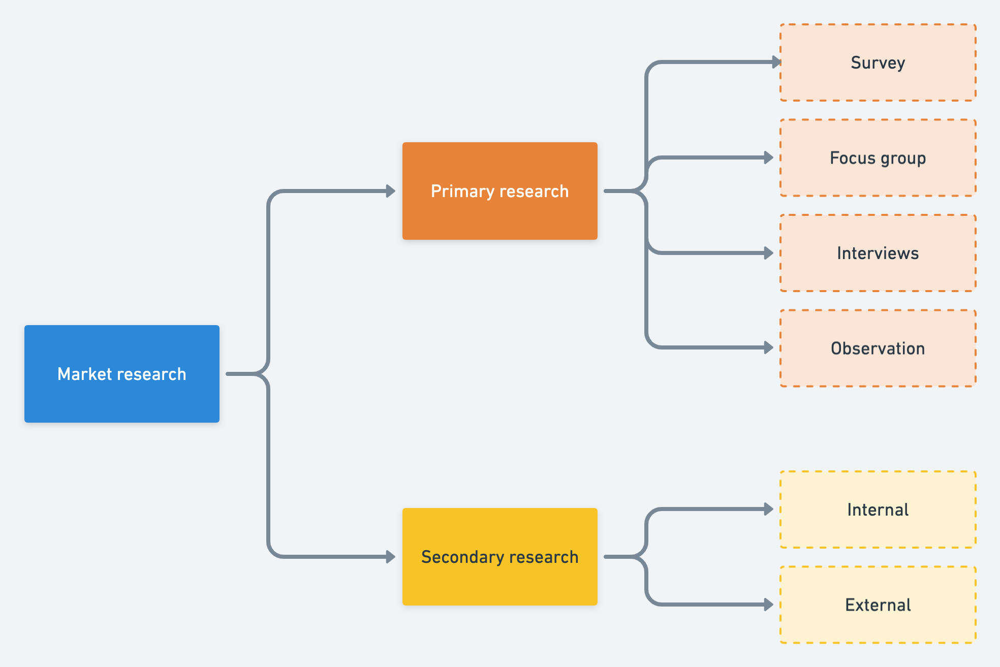

Once every month, we gather for Radar update to round up the cool techs and assess if we should adopt that to the team. We kicked off the first volume not too long ago, mainly focused on what people want to dive in. More of them fell on personal interest.

This time, we got off on the different foot. We head for things that actually do our work a favor. Road to a wider and more diversified ring, Dwarves Tech Radar v2 contains the practices to simplify the workflow, new techniques/ approach methods for project toolkit setup and expand the domain knowledge.

## Trial
### Earthly: The combination Dockerfile + Makefile
A repeatable syntax builds to untangle the debugging process between the local environment and the CI platform. Earthly allows our DevOps to merge all the tools into one "Earth" and eventually simplify the whole CI/CD flow. As DevOps must integrate different files from both Makefile and Dockerfile for integration testing, Earthfile was created to remove this burden automatically.

Reproduce CI failures is also what makes Earthly more valuable. This enables developers to run CI on their local env, instead of the constantly `git commit -m "try again."`

## Assess
### Webflow: Build visual canvas without coding techniques
At some point, we figure the development phase might take more time and resources than we need. Therefore, a no-code platform is what can resolve the issue. Webflow removes the usual misunderstanding between designers and developers - enables them to convert stunning designs into production without any coding techniques.

### Volta: Hassle-free JS Tool Manager
During our work with Javascript, each project comes with different node versions. Usually, managing these versions relies mostly on nvm, requiring developers to run their CLI every time switching between projects manually. It's a waste of time and can quickly cause errors.

Volta is a hassle-free approach to manage the CLIs. In short, it detects the node versions in the JSON package, unifies them into one place, and automatically switch them as developers change their projects. Since Volta supports quick engine setup, we get to install the npm package binaries into the toolchain once and for all and then let Volta take care of the rest.

## Adopt
### Upptime
We tried out CState as our monitoring service, but CState requires low level setup at infrastructure level and therefore not suitable for our bootstrapping kit. Upptime, on the other hand, only requires a simple Github repository and a config file to get it started. We gave Upptime a twist, and rolled out our version at [stt.daf.ug](http://stt.daf.ug/)

### Domain Research Framework
Our Designers picked it up earlier this year to better create an entry way before product design. There are multiple ways to do UX research; our team also has one. This framework provides a structural approach on UX research. This method helps collect insight on a domain's business's strategy, users' behaviors, needs, pain points, etc. to build a product that meets the business's goal and solves users' existing problems. 

