# Getting Started with Webflow

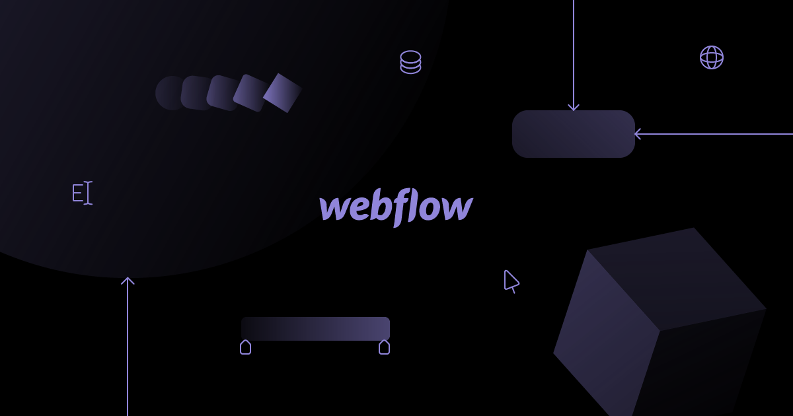

No-code platform has becoming a thing recently. With convenient and user-friendly workflow, no-code platform is a must to pick up for design and operation process, to shorten the development time and remove the misunderstanding between them with developers.
## What is Webflow
In short, Webflow is a web design tool, CMS, and hosting platform. Each aspect of the platform is represented by a particular product/feature set
### The Designer
A visual web design tool firmly grounded in web standards and best practices, the Designer translates design decisions into clean, production-ready code. Webflow was built to enable designers to develop websites familiarly — i.e., visually and effortlessly.

If you’re mostly a prototyper, you can use the Designer alone. This function either helps sharing the prototype with devs to reproduce or exporting the code.

But to fully utilizing Webflow, you’ll want to combine the Designer with the CMS and the Hosting features.
### The CMS
As the Designer, the CMS is a code-free web development tool. It has both in-Designer elements (where the site designer works) and on-site elements (where the client and/or content managers work).

For now, know that in the Designer, the CMS lets you structure content types you’ll publish over and over again — like blog posts, product pages, etc. — by combining modular “fields.” Once you’ve created your content types, which we call Collections, you can use the Designer to determine how Collection items look on the site.
### Hosting
The final piece of the Webflow puzzle is the Hosting platform. Backed by Amazon Web Services (AWS) and Fastly, it’s blazing fast, super-reliable, and you’ll need it to enjoy some of the best features, including:
- The CMS
- The Editor
- Form management

Responsive images (using a device to automatically resizing images)

Free SSL/HTTPS (for site security, which is a must for Google’s visitor permission)

Okay, now that we have the lay of the land, let’s talk about diving in.
## Setup before Designing
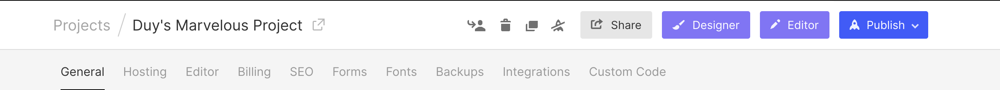

Firstly, we’re recommended to fill in the default font, font size, and project name. The hosting, domain setup, embedded incode, SEO, Google analytic, and more benefits can be adjusted within the plans

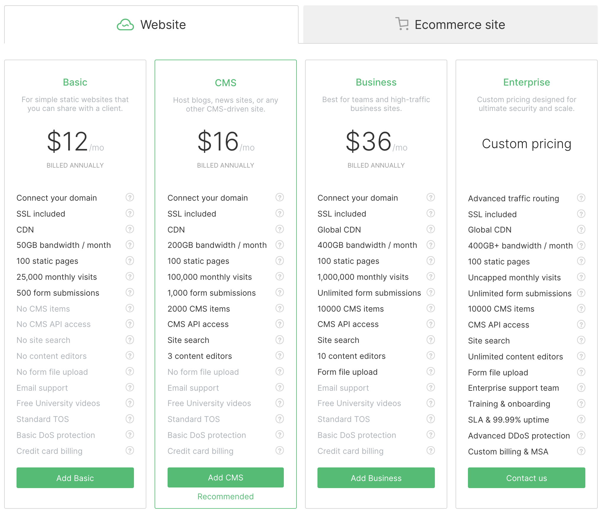

## Getting Started
### Toolbar
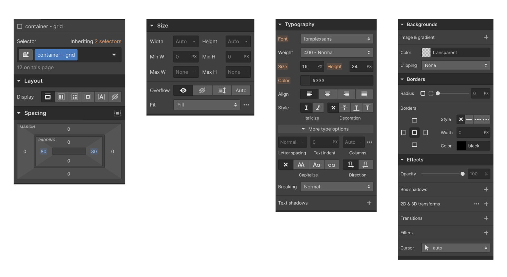
Let’s start with the first image. From left to right:

- Selector: It is a component (which can create a component for all elements). "Container - grid" is a component which I named it. Considering about create a component in case you reuse that element regularly.
- Spacing: Includes Padding and Margin. Padding is the space in the block; the margin is the outer space. Each container, text block, link block... can be adjusted for margin and padding depending on the purpose of use.
- Layout: There are 5 types of Layout. Depending on usage needs, each layout helps us build our website differently.
- Typography: We can input fonts from our laptop or directly from google font. You should check it out yourself; it’s easier than you think.
- Background, Borders, and Effects: like in Figma or sketch, we can edit the background image, radius, have fun with shadows, …

### Navigator
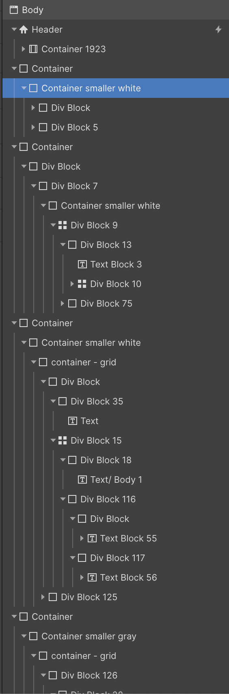

This point can be a red flag. In this case, we’re encouraged to create and name container components for regular-use ones.

*Tips*: Name a component right after you create one. The component arrangement is the foundation of your website, especially responsive. It is the same as in Figma or sketch, a carefully arranged component is easier to edit, modify, and check back when needed.

## Design a Website
> *"All website look the same"*

A website is divided into 3 parts: Header, Body, and Footer.

### Header

To add a Header, click “Cmd+K” and search for the keyword “NavBar” or look at the left corner.

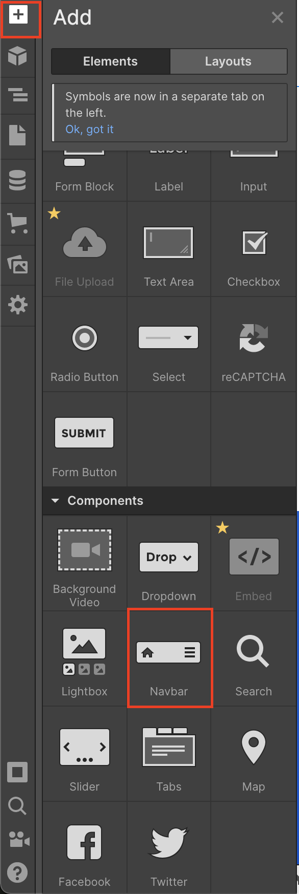

NavBar is created with Brand, Nav Menu and Menu Button, located in one container.
- Brand: can be replaced with your company’s logo
- Nav menu: can be replaced with text. I use a burger menu in this case.
- Menu Button:  I use a burger menu, but normally this could be a CTA.

*Tips*:  Check out “How to made a Navbar on Webflow” on Youtube for more information. It might hard sometimes for beginners.

### Body
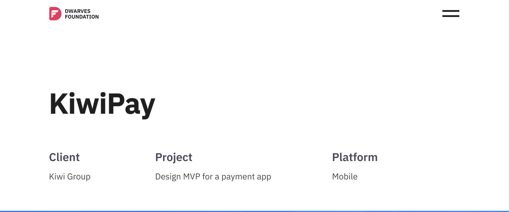

*Example*: Before doing design on Webflow, let’s define how these elements are grouped. The body should be divided into 4 areas.

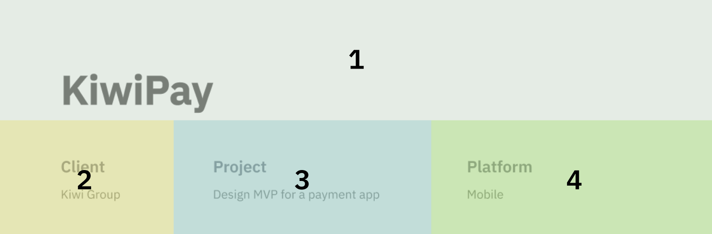

1. **Grid Layout**
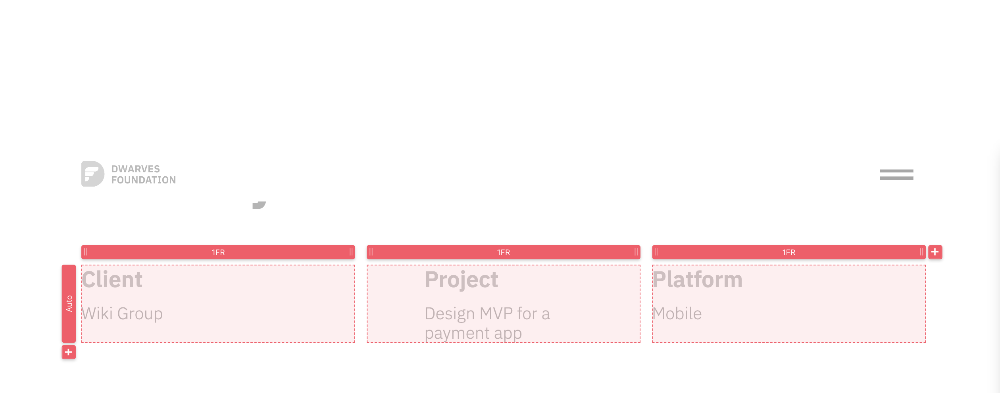

2. **Default grid with padding/ margin**

*Tips*
- Divide your design’s layout, group them by div block
- Create a component for regular-use
- Create a large area (main container) to support div blocks in the website
- Responsiveness

### Footer
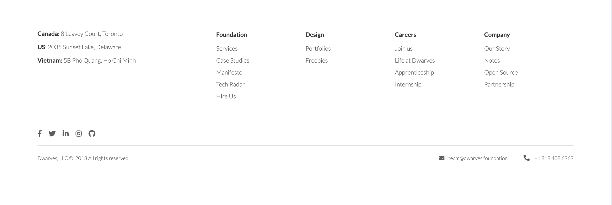

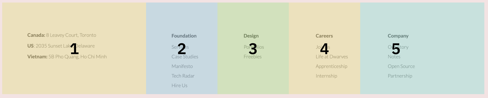

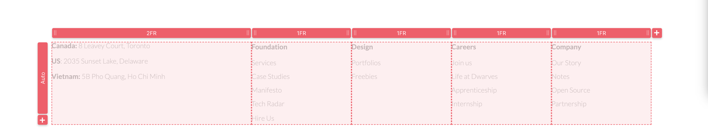

In this case, the grid layout is used to create an equal space for Div Block from 2 to 5, when Div Block No.1 needs a larger space. A Vertical direction can be used to help adjust this

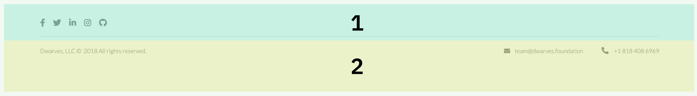

This section is divided into 2 parts:
- Social link and one div block with height: 1px (for line text)
- Email and phone number

*Tips*
- For clickable content, choose “Link Block” instead of “Text Block”.
- Layouts are critical to better create responsiveness.

## Responsive

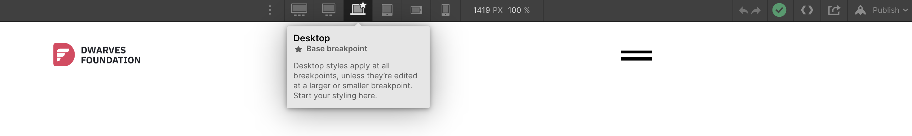

It always starts with a Base breakpoint screen. When you do the responsive for a bigger screen or mobile, it’s much effortless.

*Tips*
- Images can be unexpectedly resized based on screen sizes. To prevent this, put images into a div block. The automatically responsiveness of div block can help maintain the images size.
- Layout, padding and margin can be adjusted based on screen sizes. In case the components position are changed, the whole process will be reset.
- The color, text style, font size, font-weight can be modified

## Animation

You can play with default animation or create your own one. For more Page animation, this [youtube link](https://www.youtube.com/watch?v=69RRSEHWfCQ&ab_channel=Webflow) might help.

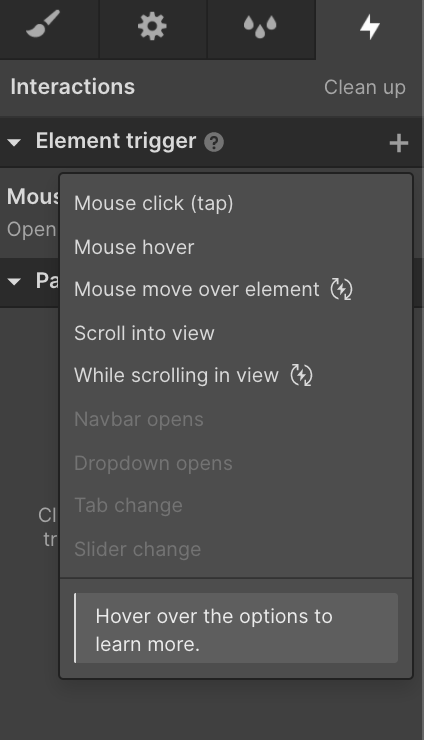

Check out my [full case study](https://kiwipay.webflow.io/). I added some effects at the burger menu and CTA.

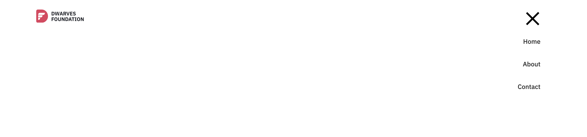

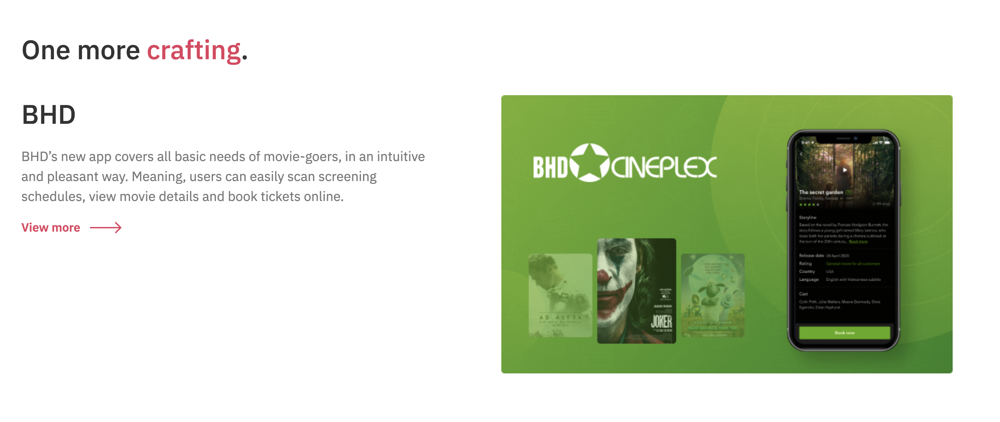

## Wrapping Up
Within a month of designing with Webflow, I can learn and practice much more to produce a more high-end website. Besides, I found out that this tool's Preview is sometimes unstable, which annoyed me, but the output was outstanding.

Webflow is such a flexible tool, and now designers can work with design tools and a No-code platform for more fast and stunning achievement. I hope that these tips will spark some ideas and help you be a more efficient product designer.